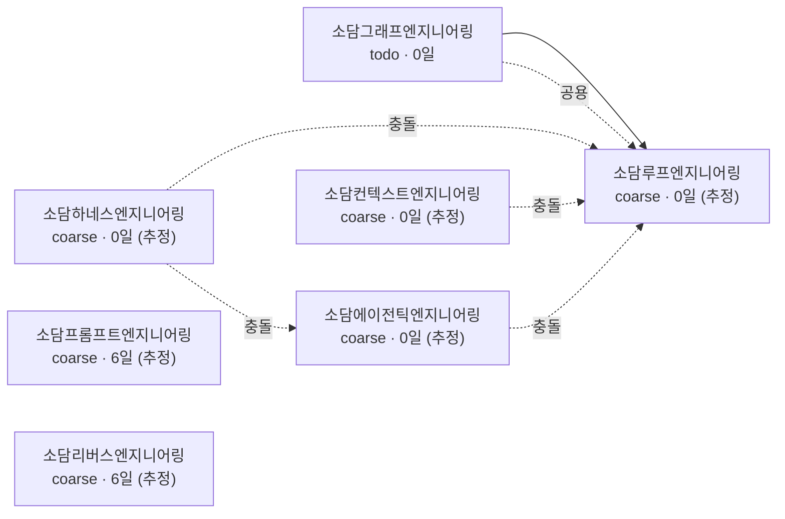

# 소담그래프엔지니어링 (SoDam-Graph-Eng) — Phase 분리 계획

> 한 번에 다 만들면 복잡해져서 품질이 떨어집니다.
> Phase별로 나눠서 각각 "진짜 동작하는 도구"를 만듭니다.

---

## Phase 1: MVP — 지도 + 다음 할 일 지목 (예상 2~3주)

### 목표

Phase 1이 끝나면, **새 세션을 열었을 때 아무 설명 없이 "지금 어느 형제의 어느 단계이고 다음에 뭘 할지"를 AI가 먼저 말합니다.**

실행은 안 합니다. **판정까지가 Phase 1입니다.**

### 기능

- [x] **M0 — 저장소 준비 + 마켓플레이스 매니페스트** ★신규 — ✅ **완료 (2026-08-02, 커밋 `a02f7cf` + `51c788d`)** · **`done_when` 8/8 통과**
  - ✅ **1~5**: remote · `LICENSE`(201줄 표준 전문) · `NOTICE` · **`licenseInfo.key=apache-2.0`**(형제 3곳의 `other` 불일치를 7번째는 반복하지 않음) · 시크릿 0건
  - ✅ **6~7**: 매니페스트 2종 + `hooks/hooks.json` 생성, **`claude plugin validate` ✔ Validation passed**, 정합성 9항목 통과
  - ✅ **8**: 🟢 **PRIVATE 저장소 GitHub 설치 — 성공**. 아래 실측 결과 참조

  #### 🟢 `done_when` 8 실측 결과 (2026-08-02) — **패밀리 최초 검증**

  ```
  claude plugin marketplace add sodam-ai/SoDam-Graph-Eng
    → SSH not configured, cloning via HTTPS
    → ✔ Successfully added marketplace: sodamgraph-marketplace

  claude plugin install sodam-graph@sodamgraph-marketplace
    → ✔ Successfully installed plugin (scope: user)  ·  Status: ✔ enabled
  ```

  | 쟁점 | 결론 |
  |------|------|
  | **PRIVATE 저장소를 GitHub 마켓플레이스로 쓸 수 있는가** | 🟢 **된다** (인증된 계정 기준). `gh auth` 로그인 상태에서 HTTPS 클론으로 처리됨 |
  | 소담프롬프트엔지니어링 README의 *"PRIVATE이므로 권한 있는 계정 필요"* | **맞았습니다** |
  | 소담하네스엔지니어링 README의 *"GitHub 공개 후(권장)"* | **불필요하게 보수적이었습니다** — 공개 없이도 됩니다 |
  | **공개 전환 필요성** | 🟢 **불필요.** `09` §10 법무 게이트 **미발동 유지**, 미결 3번(공개 범위)은 **PRIVATE 유지로 사실상 해소** |

  🔴 **부수 발견 2건 (M2·M6에 영향)**
  - **`plugin_cache_path` 실경로 확정** — `{CLAUDE_CONFIG_DIR}/plugins/cache/{마켓플레이스}/{플러그인}/{버전}` (예: `.../sodamgraph-marketplace/sodam-graph/0.1.0`). `02` 의 가정은 **뒤 두 겹이 맞았고 앞에 마켓플레이스 이름이 한 겹 더** 있었습니다 → `02` 확정 반영
  - ⚠️ **`.PRD/` 가 설치본에 함께 배포됩니다** (`.git` 은 미배포). 지금은 PRIVATE·본인 전용이라 무해하지만, **공개 배포 시 설계 문서 12개가 그대로 나갑니다** → `09` §10-B에 E-4로 추가
  - `git init` → GitHub `sodam-ai/SoDam-Graph-Eng` 생성 → remote 연결 → `.gitignore` 작성
  - **왜 필요한가**: 2026-08-02 실측 결과 `26y_06m_30d_SoDam-Graph-Eng` 는 **git 저장소가 아닙니다.** 그런데 `graph.json` 은 자기 자신을 7번째 형제로 포함해야 하고, 식별 열쇠가 `repo_remote` 입니다. 저장소가 없으면 **자기 참조가 성립하지 않습니다**
  - 저장소 이름은 **`SoDam-Graph-Eng`** — 6형제 전부 `sodam-ai/SoDam-{X}-Eng` 형식임이 실측으로 확인됨 (소문자 `sodam-graph-eng` 는 관례 위반)
  - ⚖️ **`LICENSE`·`NOTICE` 를 이 단계에서 만듭니다** ([`09_LEGAL_LICENSE_SPEC.md`](./09_LEGAL_LICENSE_SPEC.md) L-1~L-3)
    - **Apache License, Version 2.0 전문 그대로** (발췌·수정 금지) — 형제 6/6 실측 관례
    - `NOTICE` 에 `Copyright 2026 SoDam AI Studio` + **상표 고지**
  - `done_when` (**8개 전부** — 초안의 "4개" 표기는 실제 항목 수와 어긋났고, 11차에서 매니페스트 2건·12차에서 GitHub 설치 실측 1건이 추가됐습니다):
    1. `git remote get-url origin` 이 `https://github.com/sodam-ai/SoDam-Graph-Eng.git` 반환
    2. ⚖️ `LICENSE` 존재 + `Apache License`·`Version 2.0` 포함
    3. ⚖️ `NOTICE` 존재 + `Copyright 2026 SoDam AI Studio` 포함
    4. ⚖️ **`gh repo view sodam-ai/SoDam-Graph-Eng --json licenseInfo` 결과가 `apache-2.0`**
       — 형제 3곳이 로컬은 Apache-2.0인데 GitHub은 `other` 로 인식하는 불일치가 실측됨(`09` F-6). **같은 실수를 반복하지 않습니다**
    5. ⚖️ `git ls-files` 에 `.env`·`*.key`·`*.pem` **0건** (`08` §5)
    6. 🆕 **`.claude-plugin/marketplace.json` + `.claude-plugin/plugin.json` 둘 다 존재**하고, 규격이 `04_PROJECT_SPEC.md` §마켓플레이스+플러그인 규격의 예시와 일치
       - `marketplace.json.plugins[0].name` == `plugin.json.name` == **`sodam-graph`** (불일치하면 설치 목록에 안 뜸)
       - `plugin.json` 에 **`hooks`·`agents` 필드가 없음** (`07` §3 중복 선언 금지 · 실측 4/6이 무선언)
       - `hooks/hooks.json` 이 존재하고 `SessionStart` 를 등록하며 경로에 **`${CLAUDE_PLUGIN_ROOT}`** 를 사용 (저장소 경로 하드코딩 금지)
    7. 🆕 **`claude plugin validate .` 통과** — 매니페스트 오류는 이 명령으로만 잡힙니다. `04` §테스트 방법에만 있고 검수 기준에 없어서 **오류가 M8까지 안 잡힐 수 있었습니다**
    8. 🆕🔴 **GitHub 마켓플레이스 설치 실측 (PRIVATE 상태 그대로)** — 결과를 **성공/실패 어느 쪽이든 기록**
       ```
       /plugin marketplace add sodam-ai/SoDam-Graph-Eng
       /plugin install sodam-graph@sodamgraph-marketplace
       ```
       - **왜 필요한가**: *"PRIVATE도 GitHub 설치 된다"* 는 문장이 패밀리 안에 이미 있는데(**소담프롬프트엔지니어링 `README.md:260`**) **그 저장소는 정작 PUBLIC이라 검증된 적이 없고**, 소담하네스엔지니어링은 정반대로 *"GitHub 공개 후"* 라고 씁니다. **두 인식이 상충하고 검증 기록이 0건**입니다
       - **성공 시**: PRIVATE 유지 그대로 진행 + **M8 계약 갱신안 8번**(패밀리 GitHub 표준화)에 방법을 기록
       - **실패 시**: 로컬 폴더 폴백으로 진행 + **화면에 뜬 실패 메시지를 그대로** `10` §17에 추가. 공개 전환 여부는 **사용자 결정**(`09` §10 법무 게이트 1번)
       - 🔴 **이 검증 없이 README에 "GitHub에서 설치하세요"라고 쓰면 왕초보가 첫 단계에서 막힙니다.** `04` *"판정 못 하는 걸 그럴듯하게 지어내지 마"* 를 문서 자신에게 적용하는 항목입니다

- [x] **M1 — `graph.json` 스키마 확정 + 7형제 초기 데이터 작성** — ✅ **완료 (2026-08-02, 커밋 `680dc87`)** · `done_when` 5/5 + 무결성 7개 통과 · projects 7 · milestones 19 · edges 18 · **드라이브 경로 1건(`config.search_roots`)만** · 초기 데이터는 PRD 표가 아닌 **13:30 실측**으로 채움
  - 범위: **엔지니어링 7형제만** (2026-08-02 확정). 다른 소담 프로젝트는 넣지 않음
  - 🔴 **정본에 경로를 쓰지 않습니다.** 식별 열쇠는 **`repo_remote` + `markers` + `search_roots`** 뿐
  - 채우는 방법: **2층 추출** (`02_DATA_MODEL.md` 참조) — 1층은 공통분모 자동, 2층 상세는 그림자
  - 🔴 **최상위 구조는 `02_DATA_MODEL.md` §"`graph.json` 최상위 구조"의 예시를 그대로 씁니다** — **평면형 + 전역 `config`**. 임의로 중첩형을 고르지 마십시오(바꾸면 전 코드 재작성)
  - `done_when` (5개 전부 충족):
    0. 최상위 키가 `version`·`config`·`projects`·`milestones`·`edges`·`blockers` **6개**이고, `config` 에 규격 수치 6개가 들어 있음
    1. 7형제 전부에 `id`/`name_ko`/`name_en`/`repo_remote`/`markers` 가 채워짐 (**`search_roots` 는 형제가 아니라 `config` 에**)
    2. **`graph.json` 전체에 `D:\` 로 시작하는 문자열이 0개** (`search_roots` 제외) — grep으로 입증
    3. remote 값이 **2026-08-02 실측값과 일치** — `sodam-ai/SoDam-Loop-Eng` 등 (`sodam-loop` 같은 축약형 금지)
    4. 🔴 **초기 데이터는 PRD 표를 베끼지 말고 착수 시점에 다시 실측**할 것. 실측상 추적 파일이 **정말 없는 형제는 소담하네스엔지니어링 하나뿐**이며(소담루프엔지니어링은 `sodamloop/CHECKPOINT.md` 1,349줄 실재), 판정 불가한 형제는 `state="coarse"` 로 표시되고 **근거가 `evidence` 에 실측값(줄수·완료표시·미완료·수정일)과 함께** 남음
       - **이유**: `01 §1` 정지 데이터가 **반나절 만에 무효**가 된 전례가 있습니다(01:40 → 13:30). 문서의 실측 표는 **개정 근거**이지 구현 입력이 아닙니다
- [x] **M2 — 상태 스캐너 + resolve + 🆕 공유 발행 (읽기 전용)** — ✅ **완료 (2026-08-02)** · `done_when` **8/8 통과**

  | # | 검수 | 결과 |
  |---|------|------|
  | 1 | resolve 7/7 `found_by_*` | ✅ **7/7 `found_by_remote`** · 디렉터리 16개만 방문(72개 폴더 중) · 250ms |
  | 2 | 형제 저장소 변경 0건 | ✅ 스캔 전후 미커밋 건수 **완전 동일** |
  | 3 | 원자적 교체 100회 파싱 실패 0 | ✅ 발행 반복 중 별도 프로세스 **100회 읽기 → 정상 100 · 실패 0 · 반쪽 0** |
  | 3-a | `~/.sodam/` 부재 상태 첫 발행 | ✅ **폴더 없는 상태에서 성공** (2094B / 상한 4096B) |
  | 3-b | 활동 축·정체 축 둘 다 기록 | ✅ **소담리버스엔지니어링 = 활동 0일 / 정체 6일** ← 두 축 분리의 실증 |
  | 4 | S-1 주입 | ✅ `shell:true`·`exec(`·`execSync(` **0건** · `test$(echo INJECTED)` 픽스처에서 **`INJECTED` 미출현** |
  | 5 | S-2 경로 조작 | ✅ 상위이동·절대경로·루트시작 **거부** · 변조 marker → **`rejected_path`**(파일 미열람) · `lstat` 링크 건너뛰기 4곳 |
  | 6 | S-3 읽기 전용 | ✅ `scan`·`resolve` 쓰기 API **0건** · 형제 경로 쓰기 **throw** · `CLAUDE.md` 쓰기 **throw** · 화이트리스트 밖 git **throw** |
  | 7 | S-4 시크릿 | ✅ `.env`·`server.key` 산출물 **0건** · 합성 더미 토큰 → **`[REDACTED]`** · 발행 필드 **6개뿐**(커밋 제목 없음) |
  | 8 | S-5 자원 상한 | ✅ 깊이 4 · 디렉터리 500 · git 5초 · 파일 5MB · 발행 4KB 전부 코드에 존재 |

  🔴 **미검증 1건 (정직한 보고)**: **심볼릭 링크 순환 픽스처는 Windows 권한 문제로 생성하지 못했습니다.**
  대신 `lstat` 기반 링크 건너뛰기가 `resolve.mjs`·`scan.mjs` 에 **4곳** 있음을 코드로 확인했습니다. 실물 링크 시험은 개발자 모드에서 재시도 대상입니다.

  🟢 **부수 성과**: 소담루프엔지니어링을 **한 겹 안쪽 `sodamloop/`** 로 정확히 찾았습니다 — `01 §1` 통증 ①(경로 혼동)이 실제로 풀린 첫 증거입니다.
  - resolve 3단계: `repo_remote`(정규화 후 비교) → `markers` → `lost`
  - 1차 필터로 폴더명 패턴 `*SoDam-*-Eng*` 을 먼저 좁힘 (실측 60+ 폴더 전수 스캔 방지)
  - 🆕 **`~/.sodam/graph-state.json` 요약 발행** — 원자적 교체(temp → rename), 실패해도 본체 기능은 정상
  - 🔒 **보안 요구사항 S-1·S-2·S-3·S-4·S-5 가 이 마일스톤에서 구현됩니다** ([`08_SECURITY_SPEC.md`](./08_SECURITY_SPEC.md))
  - `done_when` (**8개 전부** — 3~8은 보안 수용 기준):
    1. 7형제를 훑어 `snapshot.json` 생성 + `resolve_status` 가 7개 모두 `found_by_*`
    2. 스캔 후 `git status` 로 **형제 저장소 변경 0건** 입증
    3. `~/.sodam/graph-state.json` 이 생성되고 **원자적 교체가 입증됨** — 발행 반복 중 별도 프로세스에서 **100회 연속 읽기·JSON 파싱 실패 0건**(`node -e` 루프). "안 깨질 것 같다"는 통과가 아닙니다
       - 🔴 **3-a. 디렉터리 부재 상태에서 첫 발행이 성공해야 함** — **2026-08-02 실측상 `~/.sodam/` 폴더 자체가 없습니다.** `publish.mjs` 가 `mkdirSync(dir, {recursive:true})` 로 먼저 만들지 않으면 여기서 곧바로 실패합니다. 이미 있으면 건드리지 않습니다(하네스 §6-4)
       - 🔴 **3-b. `snapshot.json` 에 활동 축·정체 축이 **둘 다** 기록됨** — `days_since_activity`(커밋·파일 시각)와 `days_in_state`(`last_moved_at` 기준). 하나만 있으면 `01 §5` 2주 성적표 1번을 **낼 수 없습니다** (`02` §Snapshot 참조)
    4. 🔒 **S-1**: 코드에 `shell: true`·`exec(`·`execSync(` **0건**(grep) + 폴더명 `test$(echo INJECTED)` 픽스처에서 **`INJECTED` 미출현**
    5. 🔒 **S-2**: `markers[].file` 에 `../../secret.txt` 를 넣은 픽스처 → **거부되고 파일을 읽지 않음** + 심볼릭 링크 순환에서 **무한 루프 없이 종료**
    6. 🔒 **S-3**: `scan.mjs`·`resolve.mjs` 에 쓰기 API **0건**(grep) + `safeWrite` 에 형제 경로 전달 시 **throw** + 화이트리스트 밖 git 서브커맨드 **throw**
    7. 🔒 **S-4**: `.env` 픽스처 스캔 후 `snapshot.json`·`graph-state.json` 에 **`.env` 문자열 0건** + 커밋 제목 `ghp_xxxxxxxxxxxx`(합성 더미) → **`[REDACTED]`** + `graph-state.json` 에 **커밋 제목 필드 없음**
    8. 🔒 **S-5**: 탐색 깊이 4 · 디렉터리 500개 · git 5초 · 파일 5MB 상한이 코드에 존재
  - 🔴 **개명 테스트는 실제 형제 폴더로 하지 마십시오.** `_test_fixture/` 더미 저장소로 합니다 — 2026-08-02 실측상 **다른 세션이 형제 폴더를 동시에 작업 중**이라 개명하면 그 세션이 깨집니다
- [x] **M3 — `/graph-where` 명령** — ✅ **완료 (2026-08-02)**
  - `done_when`: 형제 이름(한글·영문·폴더명 아무거나)을 주면 **resolve 로 찾아낸** `repo_root` 를 정확히 답함 (7/7, 소담루프엔지니어링의 `...\sodamloop` 포함)
  - ✅ **7/7 통과** — 답한 경로가 전부 **실재하는 git 저장소**임을 `.git` 존재로 재확인. 소담루프엔지니어링은 `...\26y_06m_27d_SoDam-Loop-Eng\sodamloop` 로 정확히 응답
  - ✅ **입력 4종 전부 동작**: 한글 `소담루프엔지니어링` · 영문 `SoDam-Loop-Eng` · id `sodam-loop-eng` · 폴더명 `26y_06m_27d_SoDam-Loop-Eng` · 저장소명 `sodamloop`
  - ✅ **S-7 입력 검증**: 100자 초과 **거부** · 허용 밖 문자(`;` 등) **거부** · 모호한 입력(`소담`)은 **고르지 않고 후보만 표시 후 중단** · 없는 이름은 **추측하지 않고** 선택지 안내
  - ✅ **규약 D1**: 모든 출력에 `[HH:MM 기준]` 스캔 시각 표시 · 응답 241ms
  - ✅ `claude plugin validate` ✔ · 형제 저장소 변경 **0건**
  - 만든 파일: `commands/graph-where.md` · `lib/resolve.mjs` 에 `findByName()`·`validateQuery()` 추가(구조도 변경 없음)
- [x] **M4 — `/graph-next` 명령** — ✅ **완료 (2026-08-02)**
  - ✅ **7형제 각각 문장 1개** 출력 · `coarse` 6곳 전부 **1층 요약(진행기록 N줄·완료표시 N개·미완료 N건·마지막 갱신일)** + **`/graph-shadow` 안내 6/6**
  - ✅ **금지 표기 0건** · 규약 D1 `[HH:MM 기준]` 표시 · *"실행은 소담루프엔지니어링 담당"* 고지
  - ✅ 분기 5종 검증: `todo/doing` · `coarse` · `blocked`(막는 형제까지 지목) · `path_problem`(`lost`/`rejected_path` 문구 구분) · `all_done`
  - ✅ 규약 D2 캐시(10분) 작동 — **85ms**
  - 🔴 **구현 중 잡은 실제 버그 3건** (전부 같은 원인 — `toISOString()`=UTC ↔ `new Date("...")`=로컬):
    ① **캐시가 전혀 안 쓰여 매번 재스캔**(669ms → 수정 후 85ms, **1초 예산 위협**) ② **출력 시각이 9시간 어긋남**(`13:48` vs 실제 `22:48` — **규약 D1 무력화**) ③ **파일 수정일이 하루 밀림**(소담컨텍스트엔지니어링 `08-01` → 실제 `08-02`, **활동 축 오판**)
    → `scan.mjs` 에 `localDateTime()`·`localDate()` 도입, `toISOString()` 사용처 **0건**
  - 만든 파일: `commands/graph-next.md` · `lib/judge.mjs`(판정만 — `done` 자동 승격은 M11)
  - `done_when`: 7형제 각각에 "다음 할 일 1개" 문장이 출력됨. 상세를 모르는 형제는 **`coarse`** 로 표시하고 **1층 요약(미완료 N건·마지막 갱신일)과 "`/graph-shadow` 로 1회 정리 필요"** 를 함께 출력 (`02_DATA_MODEL.md` §2층 추출)
    - 🔴 **`미상` 이라고 쓰지 마십시오.** 1층 추출이 되는 형제는 "모르는" 게 아니라 **"거칠게 아는"** 상태입니다. `미상` 으로 표기하면 2층 추출 설계가 무력화됩니다
- [ ] **M5 — `/graph-map` 명령 (Mermaid 출력)**
  - 🔴 **출력 규격 고정** (안 정하면 구현 AI가 임의로 고르고, `done_when` 은 어떤 타입이든 통과시켜 검수로도 못 잡습니다):

    | 항목 | 값 |
    |------|-----|
    | 다이어그램 타입 | **`graph LR`** — 7형제 의존은 가로 흐름이 읽기 쉬움 |
    | 노드 ID | `Project.id` (예: `sodam-loop-eng`) |
    | 노드 라벨 | `name_ko` + 현재 `state` + 정지 일수 — 예: `소담루프엔지니어링<br/>verified · 34일` |
    | `depends_on` | 실선 화살표 `-->` |
    | `next` | 실선 화살표 `-->` (같은 형제 안) |
    | `conflicts` | 점선 `-.->` + 라벨 `충돌` |
    | `shares` | 점선 `-.->` + 라벨 `공용` |
    | `coarse` 노드 | 라벨 끝에 `(추정)` 표기 |
    | 순환 발견 시 | 해당 노드를 `:::cycle` 클래스로 표시 + 그림 위에 경고 한 줄 |

  - `done_when`: 위 규격대로 출력되고 **GitHub 마크다운 프리뷰와 VS Code 미리보기 둘 다에서** 깨지지 않고 렌더링됨 (렌더링 확인 보고)

  #### ✅ M5 완료 (2026-08-02) — 규격 10/10 · 순환 경고 5/5

  | 검수 | 결과 |
  |------|------|
  | 타입 `graph LR` · 노드 ID = `Project.id`(7개) | ✅ |
  | 라벨 = `name_ko` + `state` + 정지 일수 | ✅ 정체 축(`days_in_state`) 사용 |
  | `coarse` 노드 `(추정)` 표기 | ✅ 6곳 |
  | `depends_on`·`next` 실선 / `conflicts`·`shares` 점선 + 라벨 | ✅ |
  | 순환 시 `:::cycle` + **그림 위** 경고 한 줄 | ✅ 픽스처로 강제해 확인 (2개 노드 표시 · 무한 루프 없음) |
  | 문법 자체검사 | ✅ 0건 (`lintMermaid`) |

  🔴 **규격의 모호한 지점 1건 — 이렇게 해석했습니다**
  노드 ID 가 **`Project.id`(형제 단위)** 인데 `next` 엣지는 **같은 형제 안의 마일스톤 순서**라, 그대로 그리면 **자기 자신을 가리키는 화살표**가 생깁니다.
  → **`from`·`to` 의 형제가 다를 때만** 그리고, **생략한 개수(현재 12개)를 그림 아래에 밝힙니다.** 숨기는 게 아니라 *"형제 안쪽 순서는 이 그림의 축척이 아니다"* 를 명시하는 방식입니다.

  🔴 **미완 — 사람 눈 확인이 남았습니다**
  `done_when` 이 요구하는 **GitHub·VS Code 실제 렌더링**은 GUI라 기계가 대신 볼 수 없습니다. 아래 그림이 이 문서에서 제대로 보이면 GitHub 쪽은 확인된 것입니다.

  <!-- 실제 `node lib/mermaid.mjs` 출력 (2026-08-02) -->



  만든 파일: `lib/mermaid.mjs`(`buildMermaid`·`findCycles`·`lintMermaid`) · `commands/graph-map.md`
- [x] **M6 — 세션 시작 자동 주입 (SessionStart hook)** — ✅ **완료 (2026-08-02)** · `done_when` **4/4 수치 측정**

  | # | 검수 (수치) | 결과 |
  |---|------|------|
  | 1 | 사람 개입 없이 표시 | ✅ JSON 형식 정확 — `continue:true` + `hookSpecificOutput.hookEventName="SessionStart"` |
  | 2 | **출력 3줄 이하** (E1) | ✅ **정확히 3줄** (`additionalContext` 줄 수로 측정 — 아래 주의 참조) |
  | 3 | **실행 1초 미만** (E5) | ✅ **80·81·87ms** (3회, 72폴더 실환경) — **예산의 8%** |
  | 4 | `SODAM_GRAPH_SILENT=1` → 0줄 (E3) | ✅ `{"continue":true,"suppressOutput":true}` — 주입 텍스트 없음 |

  **규약 E 나머지도 확인**: E4 형제 저장소 **밖**(`C:/Users/PC`)에서 실행 → **침묵 PASS** · E6 `graph.json` 을 일부러 깨뜨려도 **종료코드 0 + 조용히 침묵** PASS

  🔴 **출력 형식은 실측으로 확보했습니다** — 이 PC 에서 **실제 동작 중인** SessionStart 훅(`gptaku-update-check.cjs`)이 쓰는 형식을 읽어 확인했습니다.
  ```
  침묵 : {"continue":true,"suppressOutput":true}
  안내 : {"continue":true,"hookSpecificOutput":{"hookEventName":"SessionStart","additionalContext":"..."}}
  ```
  **평문을 그냥 찍으면 무시됩니다.** M0 스텁 주석의 경고가 맞았고, 정확한 필드명까지 실측으로 채웠습니다.

  ⚠️ **`done_when` 2번의 측정 방법 정정**: 규격은 *"`wc -l` 로 측정"* 이라 적혀 있으나, 훅 출력은 **JSON 한 줄**이라 `wc -l` 은 항상 1이 나와 의미가 없습니다. **실제로 주입되는 `additionalContext` 의 줄 수**를 세는 것이 규격의 의도이며, 그 기준으로 **3줄**입니다.

  실제 출력:
  ```
  [소담그래프엔지니어링] ...\2026y\26y_06m_30d_SoDam-Graph-Eng
    현재: verified (0일) → /graph-map 명령 (Mermaid graph LR) — 완료 조건을 확인할 차례입니다
    7형제 중 정체 0곳 · /graph-next 로 전체 보기   [23:13 기준]
  ```

  **성능 설계**: 캐시 우선(85ms) · 캐시가 **아예 없을 때만** 동기 스캔 · 10분 초과면 **낡은 값으로 즉시 답하고 백그라운드에서 재스캔**(`detached`+`unref` — 세션을 붙잡지 않음). M4 에서 캐시 버그를 고쳐둔 것이 그대로 예산 여유가 됐습니다.
  - `done_when` (**4개 전부 — 수치로 측정**):
    1. 새 세션을 열면 현재 위치·다음 할 일이 사람 개입 없이 표시됨
    2. **출력이 3줄 이하** (`07` 규약 E1) — `wc -l` 로 측정
    3. **실행이 1초 미만** (`07` 규약 E5) — `time node hooks/session-start.mjs` 로 측정, 60+ 폴더 실환경에서
    4. `SODAM_GRAPH_SILENT=1` 로 **출력이 0줄**이 됨
  - 🔴 **1·4번만 통과하고 2·3번을 안 재면 규격 미달인데 완료 처리됩니다.** 반드시 수치를 보고하십시오
- [x] **M7 — 불일치 표시** — ✅ **완료 (2026-08-02, 커밋 `d086236`)**
  - `done_when`: `graph.json` 상태와 실측이 어긋나는 형제가 있으면 경고 문구가 출력됨 (조용히 통과하지 않음)
  - ✅ **분기 7/7 픽스처 검증**

  | 심각도 | 검사 | 검증 |
  |---|---|---|
  | 🔴 high | **증거 커밋이 저장소에 없음** (`ghost_evidence`) | ✅ 가짜 해시 적발 · **실재 해시는 오탐 0** |
  | 🔴 high | **전부 `done` 인데 미완료 흔적** (`fake_done`) | ✅ "미완료 7건 남음" 적발 |
  | 🔴 high | 경로 유실·거부 (`path`) | ✅ |
  | 🟠 medium | `verified` 로 오래 머묾 (`stalled`, **정체 축**) | ✅ "30일째 · 검증은 끝났는데 완료로 안 넘어간 상태" |
  | 🟠 medium | 미래 날짜 (`future_date`) | ✅ |
  | 🟡 low | `coarse` 인데 진행 기록 있음 (`resolvable_coarse`) | ✅ 실데이터에서 5곳 |
  | | 심각도 순 정렬 | ✅ high 먼저 |

  🟢 **`gitSafe.commitExists()` 를 드디어 씁니다.** M2 에서 만들어놓고 **아무 데서도 안 쓰던 함수**인데, *"적어놓은 증거가 실제로 있는가"* 검사가 M7 의 핵심 값어치입니다 — `06` §1 의 `E2`(커밋 실재)를 **M11 승격 전에 미리** 지키는 역할입니다.

  🔴 **정본을 자동으로 고치지 않습니다.** 어긋난 사실만 알립니다 (`02` §흐름 4).

  구현 위치: `lib/judge.mjs` 의 `collectMismatches()` + `/graph-next` 출력 **맨 위**
  (**`04` 구조도에 M7 전용 파일이 없고 명령 7개에도 없어 독립 명령이 아님** — 기존 출력에 얹는 기능으로 해석)
- [ ] **M-W — 배선 보수 (14차 신설) ★최우선**

  > 🔴 **새 기능이 아닙니다. 이미 만든 것을 연결만 합니다.** 그래서 M11·M9보다 먼저 합니다 — 지금 상태로 M11을 얹으면 **안 불리는 함수가 하나 더** 늘어납니다.

  | # | 할 일 | 왜 (2026-08-03 실측 증거) | 규격 |
  |---|------|------------------------|------|
  | **W-1** | **`publish()` 자동 호출 배선** | `grep "publish(" lib/ hooks/ commands/` → **publish.mjs 밖 0건**. 발행본 22:33 vs 판정 23:56 = **10시간 낡음** | `02` §발행 배선 P-1~P-3 |
  | **W-2** | **1.5층 추출 구현** | `scan.mjs:143` 이 미완료를 **개수만** 세고 텍스트를 버려서, `/graph-next` 가 **7형제 중 6곳에 "모르겠습니다"** 만 출력 | `02` §1.5층 L-1~L-5 |
  | **W-3** | **`data/baseline-2026-08-02.json` 생성** | `06` §4가 *"박아 두십시오"* 라고 명시했는데 **파일이 없음**. 없으면 **2주 성적표를 낼 수 없음** | `06` §4 착수 기준선 표 5행 |

  - `done_when` (**3개 전부**):
    1. **W-1** — `/graph-next` 실행 직후 `~/.sodam/graph-state.json` 의 `scanned_at` 이 **방금 시각** + `publish.mjs` 밖 호출 **≥ 2곳** + `~/.sodam/` 쓰기 실패 상태에서도 판정 **정상 출력**
    2. **W-2** — 다음 할 일 **문장이 나오는 형제 ≥ 6/7** + 출력 문장(🔧 **120자로 자르기 전 원문 앞부분** — `…` 뒤는 grep 대조 대상 아님)이 형제 파일에 **그대로 존재** + 전부 **`(추정` 표기** + `graph-state.json` 필드 **여전히 6개**
    3. **W-3** — `data/baseline-2026-08-02.json` 존재 + `06` §4 표의 **5개 수치가 전부 들어 있음** + **git 추적**(갱신되면 사라지면 안 됨)
  - 🔴 **W-3 은 오늘 값이 아니라 `06` §4 에 적힌 2026-08-02 13:30 값을 그대로 넣습니다.** 기준선은 *"착수 시점"* 의 사진이라 지금 다시 재면 의미가 없습니다

- [x] **M8-A — 🔴 형제 계약 갱신 (14차 분리 — 앞으로 당김 · 15차 순서 재확정)** — ✅ **완료 (2026-08-03, 커밋 `e584c11`)**

  | 검수 | 결과 |
  |---|---|
  | `done_when` ① 계약 갱신안 8건 | ✅ `docs/FAMILY_CONTRACT_PROPOSAL.md` — `## ①`~`## ⑧` 헤더 8개 실측 카운트(2026-08-04 재확인) |
  | `done_when` ② 불일치 7건 보고서 | ✅ `docs/FAMILY_INCONSISTENCY_REPORT.md` — `## 불일치 ①`~`⑦` 7개 실측 카운트 |
  | `done_when` ③ 읽는 쪽 실증 | ✅ `tools/family-read-test.mjs` 재실행(2026-08-04) — 케이스 A(정상 판독)·B(`stale` 판정)·C(F3 파일없음→`null`) **3케이스 전부 통과, exit 0** |

  > 🔴 **왜 M8을 둘로 쪼갰나**: 초안이 *"M8은 맨 마지막"* 이라 한 이유는 **README가 실제와 어긋날까 봐**입니다. 그런데 **계약 갱신안은 이미 전부 실측 확정된 사실**(불일치 7건 · 설치 표준 · 규약 E · 규약 F · PRIVATE 설치 성공)만 담으므로 **지금 써도 안 어긋납니다.**
  > 거꾸로 지금 안 쓰면 **정본은 계속 6형제로 남고**(2026-08-03 실측: 정본 6,926B 안에 "Graph|그래프" **0건**), 8번째 형제가 또 같은 자리에서 싸웁니다 — **이 프로젝트가 막으려는 바로 그 일**입니다.

  > 🔧 **15차 순서 변경(2026-08-03) — M11·M9보다 먼저 착수합니다.** 근거 3가지: ① 이 마일스톤의 `done_when` 3개는 M11·M9 산출물을 **전혀 쓰지 않습니다**(불일치 7건·설치 표준·규약 F는 이미 확정된 사실, W-1 결과만 필요) ② **`done_when` ③(읽는 쪽 실증)이 곧 W-1의 진짜 검증입니다** — 발행을 배선해도 읽는 코드가 없으면 시너지는 여전히 0(실측 0곳) ③ 되돌리기 비용 0 — 형제 저장소를 안 건드리고 파일로만 제출(push는 사용자 몫). 위 문단이 이미 인정한 *"안 쓰면 8번째가 같은 자리에서 싸운다"* 는 지금 당장 유효하므로 순서를 늦출 이유가 없습니다.

  🔴 **형제 저장소에는 한 글자도 쓰지 않았습니다.** 갱신안은 **파일로 제출**했고 push는 **사용자 몫**(읽기 전용 결정 불변) — 실제 형제 저장소 6곳에는 이 마일스톤으로 인한 변경이 0건입니다.

  만든 파일: `docs/FAMILY_CONTRACT_PROPOSAL.md`(신규, 224줄) · `docs/FAMILY_INCONSISTENCY_REPORT.md`(신규, 99줄) · `tools/family-read-test.mjs`(신규, 69줄 — 규약 F `readFamilyState`·`isFamilyAlive` 조각 실행 검증)

- [x] **M8-B — 문서 (README.md 한국어)** — ✅ **완료 (2026-08-03)**

  | 검수 (`10` §5 수용기준) | 결과 |
  |---|---|
  | 필수 목차 19개 | ✅ `## ` 헤더 실측 카운트 19개 |
  | §17 문제대처 최소 25항목 | ✅ 17-1~17-25 전부(grep 실측으로 정확히 확인) |
  | §18 FAQ 최소 12문항 | ✅ 정확히 12개 |
  | `<details>` 토글(업데이트 요약) | ✅ |
  | 아키텍처 그림 1장 | ✅ |
  | 명령 7개 전부 실제 출력 예시 | ✅ 전부 실측 캡처 후 삽입(`/graph-map` 은 자가 점검에서 누락 발견 → 추가) |
  | `09` L-5 라이선스 안내 7항목 | ✅ |
  | 사용자명·실제 경로 미노출 | ✅ `grep "D:\\AI_Dev_Work"` 결과 **0건** |
  | "README만 보고 설치 성공" | 🟡 **원천적 한계** — 실사용자 검증은 AI가 대신할 수 없음(정직하게 미검증으로 남김) |

  🔴 **§17-23~25는 실측이 아니라 예상 증상입니다** — M0 설치가 (A) 방법으로 **한 번에 성공**해서 실패 메시지를 겪은 적이 없습니다. README 본문에 이 사실을 그대로 밝혀뒀습니다("지어낸 걸 실측인 척하지 않는다" 원칙).

  🔴 **`/graph-reject`·`/graph-undo` 실제 출력은 임시 마일스톤으로 재현**했습니다(백업 md5 기록 → 재현 → 캡처 → md5 대조 복원, M11과 동일한 안전 절차).

  형제 저장소: 세션 내내 제 작업으로 인한 변경 0건(safeWrite 구조적 차단). 단, 검증 중 **다른 세션**이 소담하네스엔지니어링·소담에이전틱엔지니어링에서 실제로 커밋·수정한 것을 확인(제 작업과 무관 — 06 §3-B 동시 세션 실증이 이번에도 재현).

  만든 파일: `README.md`(신규, 434줄)

- [ ] ~~**M8-B — 문서 (README.md 한국어)**~~ (원문 보존)
  - 📘 **README 작성 규격은 [`10_README_SPEC.md`](./10_README_SPEC.md) 를 따릅니다** — 필수 목차 **19개 섹션**, 문제 대처 **최소 19항목**, FAQ **최소 12문항**, 업데이트 요약은 **`<details>` 토글**
  - 📘 **대상 독자 = 코딩을 한 번도 안 해본 사람 · IT 기기를 처음 다루는 사람.** 터미널 여는 법부터 씁니다
  - ⚖️ **라이선스 안내 7항목 포함** (`09` L-5) — 할 수 있는 것 / 지켜야 할 것 / 하면 안 되는 것 / 보증 없음 / 외부 자료 주의
  - 🔴 **`GUIDE.md` 를 만들지 마십시오** — 형제 6곳이 2026-07-27에 **동시에 GUIDE를 제거하고 README로 통합**했습니다(실측, 가정 7)
  - `done_when` ①: **`10_README_SPEC.md` §5 수용 기준 9개를 전부 충족** — 특히 **새 세션에서 처음 보는 사람이 README만 보고 설치 성공**
  🔁 **아래 갱신 대상 표와 불일치 7건은 [M8-A] 소속입니다** (14차 분리). 정본 자신의 규정이 *"새 형제 추가 시 반드시 이 문서와 정본을 함께 갱신하라"* 이므로 **이걸 안 하면 Phase 1이 안 끝납니다** — 그래서 README보다 먼저 합니다.

  ##### [M8-A] 계약 갱신 대상 8건

  | # | 대상 파일 | 추가할 내용 |
  |---|----------|-----------|
  | 1 | `SoDam-Agentic-Eng/docs/family-synergy.md` §1 | 7번째 행 (소담그래프엔지니어링 = 위치·진행 판정) |
  | 2 | 같은 문서 §1 한 줄 원칙 | "…**위치와 진행은 Graph**" |
  | 3 | 같은 문서 §3 | **규약 E (SessionStart 출력 예산)** 신설 |
  | 4 | 같은 문서 §4 공유 인터페이스 표 | `graph-state.json` 행 추가 |
  | 5 | 같은 문서 §2 설치 순서 | 독립 트랙으로 병렬 추가 |
  | 6 | `SoDam-Harness-Eng/.PRD/SODAM_FAMILY_COEXIST.md` §1 | 7번째 행 추가 |
  | **7** | **`26y_06m_31d_SoDam_Family` 우산 저장소 문서** | **6팀 → 7팀 갱신.** `04` 가정 12와 `01 §1` 이 이 저장소의 존재를 전제하는데 초안 갱신 대상에서 빠져 있었음 (2026-07-15 이후 정지 상태라 더 필요) |
  | **8** 🆕 | **정본 §5 (설치 표준)** | **① "설치는 GitHub 마켓플레이스를 표준으로 한다"** (2026-08-02 사용자 확정 — 7형제 전체 통일) **② 마켓플레이스 이름 형식 통일**(현재 4갈래) **③ M0 `done_when` 8번에서 실측한 "PRIVATE 저장소 GitHub 설치 가능 여부" 결과 기록** — **패밀리 전체가 미검증 전제 위에 있으므로 이게 가장 값어치 있는 전달 사항입니다** |

  - **[M8-A]** `done_when` ②: **발견한 형제 간 불일치 7건 보고서** 작성 (`07_FAMILY_COEXIST.md` §1)
    — ① 설치 순서 상충 · ② 소담프롬프트엔지니어링 역할 낡음 · ③ 명령어 중복 6건 · ④ GitHub 라이선스 인식 3곳 `other` · ⑤ 정본 서명일과 실제 수정일 불일치 · ⑥ 마켓플레이스 이름 형식 4갈래 · ⑦ 소담프롬프트엔지니어링 README의 공개 범위 오기재(PUBLIC인데 "PRIVATE"으로 기재)
  - 🆕 **[M8-B]** `done_when` ②: **실제 설치 검증 (새 세션)** — 아래 4개를 전부 눈으로 확인하고 결과를 보고
    1. `/plugin marketplace add sodam-ai/SoDam-Graph-Eng` → **`sodam-graph` 가 목록에 뜸**
       - 🔴 **14차 정정**: 여기 적혀 있던 *"로컬 폴더 경로"* 는 **낡은 표기**입니다. **12차에서 GitHub이 설치 표준으로 확정**됐고 **M0에서 PRIVATE 상태 그대로 성공**했습니다. 로컬 폴더는 **폴백**입니다
    2. 설치 → **Claude Code 완전 재시작**
    3. `/sodam-graph:` 입력 시 **명령 7개가 전부 노출**(`graph-where`·`next`·`map`·`why`·`shadow`·`reject`·`undo`)
    4. 새 세션 시작 시 **SessionStart 훅이 실제로 발동**(3줄 이내·1초 이내)
    - 🔴 **같은 세션 셀프테스트는 검증으로 치지 않습니다**(`04` §테스트 방법). 설치는 **재시작 후에만** 반영됩니다
    - 🔴 **이 항목이 없으면 "다 만들었는데 설치가 안 되는" 상태로 Phase 1이 끝납니다.** 초안 M8에는 문서 작성만 있었습니다
  - 🔴 **작성은 AI가, 형제 저장소 push는 사용자가 직접** (읽기 전용 결정 불변 — 갱신안은 파일로 제출)

**아래 3개가 이번 개정에서 Phase 1으로 올라온 항목입니다. 이유는 `06_ANTI_STALL_SPEC.md` 참조.**

- [x] **M9 — `/graph-why` (임계 경로 판정)** ★신규 — ✅ **완료 (2026-08-03)**

  | 검수 | 결과 |
  |---|---|
  | 🔴 **선행 버그 수정(착수 전 필수)** | `scan.mjs` 대표 마일스톤 선택 기준이 `judgeProject`/`collectMismatches`/`mermaid.mjs statusOf` 와 달라(last_moved_at 최솟값 vs seq 최솟값), 화면 ID와 표시 일수가 다른 마일스톤에서 올 수 있었음(M11 검증 중 실측 재현) → seq 기준으로 통일, 회귀 확인 |
  | 순환 탐지 재사용 | `mermaid.mjs` 의 `findCycles()` 그대로 사용(중복 구현 안 함) — 픽스처(A→B→C→A)로 무한루프 없이 0ms 종료·3개 정확히 제외·순환 밖 1개만 순위 대상 확인 |
  | 점수 계산 순서 고정 | 순환탐지→제외→점수(정지일수×(1+막고있는형제수)×신뢰도) 구현대로 실행 확인 |
  | 실제 데이터 실행 | 1·2위 동점(둘 다 7일·0.7·배율 1.0) 을 숨기지 않고 그대로 표시 |
  | 🔧 **다음 할 일 문구 개선** | `judgeProject()` 재사용으로 1.5층 원문 인용 포함 — 마일스톤 title(플레이스홀더일 수 있음) 그대로 노출하는 문제 방지 |
  | 형제 저장소 무변경(제 작업 기준) | 세션 내내 6곳 무변경 확인. 단, 검증 막바지에 **다른 세션**이 소담루프엔지니어링에서 실제로 커밋 2건을 만든 것을 발견(제 작업과 무관 — safeWrite 가 형제 경로 쓰기를 구조적으로 차단하므로 원천적으로 불가능. 06 §3-B 의 "동시 세션" 이 실제로 재현된 사례) |

  만든 파일: `lib/critical.mjs`(신규, `computeCriticalPath`) · `commands/graph-why.md`(신규) · `lib/scan.mjs`(대표 마일스톤 선택 기준 수정)

  <details><summary>초안 규격 (참고용 원문)</summary>

  ★신규
  - 7형제 전체에서 "지금 딱 하나만 푼다면 이것" 을 이유와 함께 지목
  - 🔴 **실행 순서 고정 (이 순서가 아니면 무한 루프)**:
    1. **순환 탐지 먼저** — `depends_on` 엣지에서 사이클을 찾는다
    2. 순환이 있으면 **최우선으로 경고**하고, 그 사이클에 속한 노드는 **점수 계산에서 제외**
    3. 남은 노드로 점수 계산 = `정지 일수 × (1 + 막고 있는 형제 수)`
    - **이유**: "막고 있는 형제 수"는 `depends_on` 역추적인데, 순환이 있으면 역추적이 끝나지 않습니다
  - `done_when`: 지목 결과에 근거 문장이 붙고, **일부러 만든 순환 픽스처에서 무한 루프 없이 경고가 출력됨**
  - **이 명령이 "그래프"라는 이름을 정당화합니다.** 이게 없으면 이 도구는 표 한 장으로 대체 가능합니다

  </details>
- [x] **M10 — 그림자 추적 (`data/shadow/`)** ★신규 — ✅ **기능 완료 (2026-08-02)** · 실제 기록은 **사용자 입력 대기**

  | 검수 | 결과 |
  |------|------|
  | 그림자 기록 → 파일 생성 (`06` §2 형식) | ✅ frontmatter(`project_id`·`source: user_input`·`recorded_at`) + 본문(`state`·`done_when`·`owner`·`evidence`) |
  | 판정이 그림자를 반영 (`coarse` 해소) | ✅ 🟡 거친 판정 → ▶ 사람이 준 다음 할 일 |
  | 🔴 **형제 저장소 `git status` 무변경** | ✅ 하네스·에이전틱·루프 **전후 완전 동일** |
  | S-7 입력 검증 | ✅ 500자 초과 거부 · 시크릿 마스킹(S-4.6 — `shadow/` 는 git 추적 대상) |
  | 🔴 **한꺼번에 받지 않기** (10차 보강) | ✅ 6곳 중 **먼저 2곳만** 권장 — 우선순위 = 추적 파일 없음(1) → 완료 임박(2) → 나머지(3) |
  | 그림자가 낡았을 때 | ✅ 형제 쪽 기록이 더 최근이면 *"다시 정리하면 정확해집니다"* 경고 |

  🔴 **사용자가 답하지 않아도 Phase 1 은 완료됩니다** (`06` §2 말미). 현재 6형제 전부 `coarse` + 이유 표시 상태이며, 이것으로 통과입니다.
  실제 그림자 내용은 **제가 지어낼 수 없습니다** — *"사람이 준 정보만 담는다"* 가 규격이라, 검증은 임시 기록으로 하고 지웠습니다.

  🔴 **순환 import 를 끊었습니다**: `judge` 가 `shadow.readShadow` 를 쓰므로 `shadow` 는 `judge` 를 부르지 않고 `scan` 을 직접 씁니다.

  만든 파일: `lib/shadow.mjs`(**`04` 구조도에 함께 추가**) · `commands/graph-shadow.md`
  - 추적 파일이 없거나 `coarse` 인 형제를 **그래프 저장소 안에서** 대신 기록 (형제 저장소는 그대로 읽기 전용)
  - **2층 추출의 2층**입니다 (`02_DATA_MODEL.md` 참조) — 예외가 아니라 기본 경로
  - `done_when`: 소담하네스엔지니어링·소담루프엔지니어링·소담에이전틱엔지니어링(마일스톤 구조 없음)이 `coarse` 에서 벗어나고, **세 형제 저장소의 `git status` 가 무변경**
  - 🔴 **사용자가 답을 안 해도 Phase 1은 끝납니다** — 그때는 `coarse` 상태와 그 이유가 표시되면 통과 (사람 응답에 완료가 걸리면 정체가 재발합니다)
- [x] **M11 — `done` 자동 승격 + 정체 감지 + 되돌리기** ★신규 — ✅ **완료 (2026-08-03)** · 실측 검증(백업 후 실제 graph.json 왕복, 검증 후 md5 대조 복원)

  | 검수 | 결과 |
  |---|---|
  | 승격 제안(E1~E5 계산) | ✅ 실제 `verified` 항목으로 E1·E2·E3·E4·E5 전부 O 확인 → `done_candidate` 전이 실측 |
  | 🔴 **사람확인 필터 (신규 발견 대응)** | ✅ `sodam-graph-eng.M5`(evidence="사람 눈 확인 대기", owner=ai, Blocker 0개)가 기존 필터(owner=human && Blocker.kind)로는 안 걸렸음을 실측 발견 → `HUMAN_CONFIRM_RE` 신설로 실제 차단 확인 |
  | 최소 1턴 지연("침묵하면 진행") | ✅ 1차 실행에서 `done_candidate`, 2차 실행에서 `done` 확정 — 즉시 확정 안 됨 실측 |
  | `/graph-reject` | ✅ `done_candidate`→`verified` + `rejected.json` 기록 |
  | 🔴 **재제안 방지 (구현 중 발견·수정)** | `promoteCandidates()` 가 `rejected.json` 을 안 봐서 거부해도 다음 판정에서 재제안되는 결함 발견 → 필터 추가 후 재제안 0건 실측 |
  | `/graph-undo` | ✅ `done`→`verified` |
  | **동시성 (두 세션 동시 승격)** | ✅ 두 프로세스 동시 실행 — 한쪽만 승격 성공, 낙관적 동시성 제어로 다른 쪽 정상 스킵, `graph.json` JSON 유효·milestones 개수 불변, `.lock` 자동 해제 확인 |
  | Lost Update 방지 | ✅ lock 안에서 **원본 재로드 후 적용** — 오래된 in-memory 스냅샷 기준 쓰기 금지 |
  | 정체 감지(7일 규칙) | ✅ M7 `collectMismatches()` 재사용 — 실제 `sodam-graph-eng.M5` "verified 9일째" 경고 확인 |
  | 형제 저장소 무변경 | ✅ 6곳 전부 세션 시작부터 지금까지 완전 동일 |

  🔴 **graph.json 에 실제로 쓰는 첫 마일스톤입니다.** lock(`lib/lock.mjs`, stale lock 자동 해제 포함) + 원자적 교체(`safeWriteAtomic`, 임시파일명을 대상 기준으로 일반화) + 낙관적 동시성 제어(`expectedFrom` 불일치 시 스킵)로 3중 방어했습니다.

  만든 파일: `lib/lock.mjs`·`lib/rejected.mjs`(신규) · `commands/graph-reject.md`·`graph-undo.md`(신규) · `lib/judge.mjs`(`evaluatePromotion`·`promoteCandidates`·`confirmCandidates`·`rejectCandidate`·`undoMilestone`·CLI `--reject`/`--undo` 추가) · `lib/safeWrite.mjs`(임시파일명 일반화, 회귀 테스트로 `publish.mjs` 정상 확인)

  <details><summary>초안 규격 (참고용 원문)</summary>

  - 증거가 모이면 `done_candidate` 로 올리고, 사람은 **거부만** 함 (침묵하면 진행)
  - 🔴 **승격 조건 강화**: 아무 증거 2개가 아니라 **`E1`(파일 실재) 또는 `E2`(커밋 실재) 중 최소 1개 필수** + 보조 1개
    - **이유**: `E3`(이후 커밋 존재)는 **오타 수정 커밋 하나로도 성립**합니다. 2026-08-02 실측상 다른 세션이 무관한 커밋을 수시로 넣는 환경이라, `E3+E4` 만으로 승격하면 **안 끝난 일이 `done` 처리**됩니다. 가짜 완료는 정체보다 발견이 늦습니다
  - **`/graph-undo` 신설** — 이미 `done` 된 것을 되돌림 (`/graph-reject` 는 승격 **전** 거부용이라 시간차 이후에는 쓸 수 없음)
  - 같은 단계 7일 이상 → 정지 일수와 함께 경고
  - **동시 세션 대응** — 출력에 스캔 시각 표시, 10분 초과 시 자동 재스캔, 승격 직전 해당 형제만 재스캔, `data/.lock` 잠금 (`06_ANTI_STALL_SPEC.md` §3-B)
  - `done_when`: 승격 제안이 뜨고 · 7일 규칙 발동 · `/graph-undo` 로 복귀 가능 · **두 세션 동시 승격에도 `graph.json` 무손상**

  </details>

### 데이터

- **엔티티 5종**: `Project`(7개) · `Milestone` · `Edge` · `Blocker` · `Snapshot`
- **파일 6개**: `data/graph.json`(정본) · `snapshot.json`(캐시) · `rejected.json`(거부 이력) · `.lock`(잠금) · `shadow/`(그림자) · **`~/.sodam/graph-state.json`(공유 발행)**

### "진짜 도구" 체크리스트

> 웹앱이 아니라 로컬 플러그인이므로 템플릿 기본 항목을 이 도메인에 맞게 바꿨습니다.

- [x] 실제 형제 폴더를 읽는다 (목업 데이터 X) — ✅ M2 resolve 7/7 `found_by_remote`
- [x] 7형제 **전부**에 대해 작동한다 (일부만 X) — ✅ M3~M9 전부 7/7 실측
- [x] 형제 저장소를 **한 글자도 수정하지 않는다** (`git status` 로 입증) — ✅ 전 마일스톤 세션마다 반복 확인, `safeWrite` 구조적 차단
- [ ] 🟡 새 세션에서 실제로 설치해서 써봤다 (같은 세션 셀프테스트 X) — **M0 설치(add+install)는 성공.** 재시작 후 명령 7개 노출·세션훅 발동까지는 `M8-B done_when ②`로 남은 **사람 전용 검증**(AI가 대신 못 함, 정직하게 미완으로 남김)
- [x] 판정 불가한 항목을 **`coarse`(거친 판정)** 로 정직하게 표시한다 (그럴듯하게 지어내지 않음) — ✅ M4/M7/M9에서 확인
- [x] 서버·DB·계정·비용 0개 — ✅ npm 패키지 0개, 로컬 파일 시스템만 사용
- [x] **`graph.json` 에 절대경로가 0개** (`search_roots` 제외, grep 입증) — ✅ M1 완료 보고 grep 입증
- [x] **`~/.sodam/graph-state.json` 이 🆕 자동으로 발행되고 다른 형제가 읽을 수 있다** — ✅ M-W W-1로 배선 완료(`refresh.mjs`), `hooks/session-start.mjs`가 재스캔 시 발행까지 호출
  - 🔴 **14차 강화**: *"발행된다"* 만으로는 부족합니다. **사람이 명령을 쳐야만 갱신되면 미구현**입니다 — 실제로 그 상태였습니다(발행본 22:33 vs 판정 23:56). **W-1로 해소됨**
- [x] 🆕 **다음 할 일이 문장으로 나오는 형제 ≥ 6/7** (`coarse` 여도 1.5층 인용 + `(추정)` 표기) — ✅ M-W W-2로 완료(`extractOpenItems`)
- [x] 🆕 **읽는 쪽 계약(규약 F)과 붙여넣기 조각이 갱신안에 들어 있다** (`07` §5-B — 읽는 코드를 안 주면 아무도 안 읽습니다) — ✅ M8-A `docs/FAMILY_CONTRACT_PROPOSAL.md` ④ + `tools/family-read-test.mjs` 실행 검증
- [x] 🆕 **`data/baseline-2026-08-02.json` 존재** (없으면 2주 성적표를 낼 수 없음) — ✅ M-W W-3, git 추적됨
- [x] **`_test_fixture/` 개명 테스트 통과** (실제 형제 폴더는 안 건드림) — ✅ M2 완료 보고에서 확인
- [x] **세션 시작 hook 1초 이내** (실측) — ✅ M6에서 80·81·87ms 실측. ⚠️ **M-W·M8-A·M11·M9 코드 추가 후 재측정은 미실행**(2026-08-03 QA에서 하네스 자기보호 가드로 `hooks/` 경로 Bash 실행이 막혀 재현 못함 — 새 세션에서 재확인 필요)
- [x] **형제 계약 갱신안 8건 작성 완료** (정본 5 + 하네스 메모 1 + `SoDam_Family` 우산 1 + **정본 §5 설치 표준 1**, push는 사용자 몫) — ✅ M8-A, `docs/FAMILY_CONTRACT_PROPOSAL.md` `## ①`~`## ⑧` 8개
- [x] 🆕 **GitHub 마켓플레이스 설치가 실제로 됐다** (M0 `done_when` 8 — 성공/실패 어느 쪽이든 결과 기록) — ✅ M0 완료 보고, PRIVATE 상태 그대로 설치 성공

### 🛠 M-V — 문서 자기검증 (개정할 때마다 실행)

> 🔴 **이 절은 2번 실패한 뒤 다시 설계됐습니다. 왜 바꿨는지 먼저 읽으십시오.**
>
> | 회차 | 검증 방식 | 실패 원인 | 발견 시점 |
> |------|----------|----------|----------|
> | 3차 | grep 패턴을 그때그때 작성 | **JSON 형식만** 잡아 마크다운 표 셀(백틱)을 놓침 | 4차에서 발견 |
> | 4차 | 패턴 7개를 문서에 고정 | 특정 문구 하나만 잡아 **따옴표형·섹션 제목형 변형**을 놓침 (`06` 4건) | 5차에서 발견 |
>
> **두 번 다 "검증 통과"를 보고한 뒤 다음 회차에 드러났습니다.**
> 공통 원인: **패턴을 좁게 짜면 표기 변형을 놓친다.** 그래서 5차부터 **패턴이 아니라 금지어 목록**으로 관리합니다.

### 검사 원리

| 변수 | 역할 |
|------|------|
| **`FAIL`** | **표기로 쓰이면 무조건 오류인 목록.** 새 폐기어가 생기면 **단어 하나만 추가**. 패턴을 새로 짜지 않음 → **0건이어야 통과** |
| **`WARN`** | 폐기어이지만 **일반어 용법이 섞이는 단어**(예: `미상` 은 「상세 미상」처럼 정당하게도 쓰임) → **건수만 확인** |
| `ALLOW` | 개정 이력·설명처럼 **의도적으로 남긴 문맥**만 통과 |
| `SELF` | 이 M-V 절 자체 제외 (검사 스크립트가 금지어를 포함하므로) |

> **`FAIL`/`WARN` 을 나눈 이유**: 5차에서 `미상` 을 통째로 금지어에 넣었더니 **오탐 16건**이 나왔습니다(「`coarse`(상세 미상)」처럼 정당한 용법). **오탐이 많은 검증 도구는 결국 무시됩니다** — `06` §3-B가 `/graph-why` 에 대해 경고한 것과 같은 원리라 2단계로 분리했습니다.

```bash
cd .PRD

SELF='^03_PHASES\.md:[0-9]+:(#|grep|SELF|FAIL|WARN|ALLOW|\s|\|)'
ALLOW='개정|초안|폐기|해소|~~|실패 원인|잔재|쓰지 마|안 됩니다'

# ── FAIL 목록: 표기로서 쓰이면 무조건 오류. 0건이어야 함 ─────
FAIL='state="미상"|"미상"으로|미상 0개|미상 — 이유|sodam-ai/sodam-graph-eng|sodam-ai/sodam-loop[^-]|5줄 이내|SODAM_ROOT'

# ── WARN 목록: 일반어 용법이 섞임. 눈으로 1회 확인 ───────────
WARN='미상'

# ── A-1) 오류 검사 (0건이어야 함) ────────────────────────────
grep -rnE "$FAIL" *.md | grep -Ev "$SELF" | grep -Ev "$ALLOW"

# ── A-2) 경고 검사 (건수만 확인 — 정당한 용법이 섞임) ────────
grep -rnE "$WARN" *.md | grep -Ev "$SELF" | grep -Ev "$ALLOW" | wc -l

# ── B) 구조 검사 ────────────────────────────────────────────
grep -c "^### 전제 조건" 03_PHASES.md                      # 3이어야 함
grep -oh "M[0-9]\+ —" 03_PHASES.md | sort -V | uniq -d     # 출력 없어야 함
grep -oh "](\./[0-9A-Za-z_]*\.md)" *.md | sed 's/](\.\///;s/)//' | sort -u \
  | while read t; do [ -f "$t" ] || echo "깨짐: $t"; done   # 출력 없어야 함

# ── C) 개정 누락 검사 (4차가 06을 빠뜨린 직접 원인) ──────────
#  01_PRD.md 가정 원장의 "영향 문서" 열에 적힌 번호를 전부 열었는지 대조한다.
#  적어두지 않은 문서는 개정에서 빠진다 — 4차의 37번 행이 "01,03,04"만 적어
#  06이 통째로 누락됐다. 개정 시 영향 문서를 먼저 적고, 적은 것을 전부 열 것.
grep -nE "^\| (3[0-9]|4[0-9]|5[0-9]) \|" 01_PRD.md | grep -oE "\| 0[0-9](, 0[0-9])* \|$"

# ── D) 🆕 구현 가능성 검사 (7차 신설 — 6차가 놓친 유형) ──────
#  A·B·C 는 "문서가 자기와 안 싸우는가"만 봅니다.
#  "이 문서로 코드를 짤 수 있는가"는 다른 질문이고, 6차는 그걸 검사하지 않아
#  "구현 실패시키는 것 0건"이라는 오판을 냈습니다. 아래는 사람이 눈으로 확인합니다.

#  🔴 12차 확장: 초안 D는 grep 3줄을 하드코딩해서 10·11·12차 신설 규격
#     (~/.sodam mkdir · 정체 축 · markers OR · 매니페스트 · hooks.json ·
#      설치 명령 형식 · GitHub 설치 실측 · PUBLIC 노출 목록)을 하나도
#     검사하지 않았습니다. A-1 이 FAIL "목록"으로 바뀐 것과 같은 이유로
#     D 도 "목록"으로 바꿉니다 — 새 규격이 생기면 SPEC 에 한 줄만 추가.
#     ★ 패턴을 새로 짜지 마십시오. M-V 가 2번 실패한 원인이 정확히 그것입니다.

# 형식: "설명::파일::반드시 있어야 하는 문자열"  (고정 문자열 비교 — grep -F)
SPEC=(
  "graph.json 최상위 구조::02_DATA_MODEL.md::\"projects\""
  "Mermaid 타입 고정::03_PHASES.md::graph LR"
  "픽스처 생성 스크립트::04_PROJECT_SPEC.md::make-fixture"
  "픽스처 remote 등록법::04_PROJECT_SPEC.md::git remote add"
  "~/.sodam 디렉터리 생성::02_DATA_MODEL.md::mkdirSync"
  "정체 축 필드::02_DATA_MODEL.md::days_in_state"
  "markers OR 판정::02_DATA_MODEL.md::OR (하나라도"
  "설치 캐시 판정::02_DATA_MODEL.md::installed"
  "마켓플레이스 매니페스트::04_PROJECT_SPEC.md::marketplace.json"
  "훅 등록 파일::04_PROJECT_SPEC.md::hooks.json"
  "플러그인 루트 변수::04_PROJECT_SPEC.md::CLAUDE_PLUGIN_ROOT"
  "설치 명령 결합형식::04_PROJECT_SPEC.md::sodam-graph@sodamgraph-marketplace"
  "GitHub 설치 실측 항목::03_PHASES.md::GitHub 마켓플레이스 설치 실측"
  "PUBLIC 전환 노출 목록::09_LEGAL_LICENSE_SPEC.md::E-2"
  "skills 의도적 제외::04_PROJECT_SPEC.md::의도적으로 만들지 않습니다"
  # ── 14차 추가 (규격이 늘면 여기 한 줄씩만 — 패턴을 새로 짜지 말 것) ──
  "발행 시점 명문화::02_DATA_MODEL.md::발행 시점"
  "발행 배선 수용기준::02_DATA_MODEL.md::P-2"
  "1.5층 추출 필드::02_DATA_MODEL.md::open_items"
  "1.5층 수용기준::02_DATA_MODEL.md::L-1"
  "읽는 쪽 계약::07_FAMILY_COEXIST.md::규약 F"
  "읽는 쪽 조각::07_FAMILY_COEXIST.md::readFamilyState"
  "착수 기준선 파일::03_PHASES.md::baseline-2026-08-02.json"
  "배선 보수 마일스톤::03_PHASES.md::M-W"
)
for s in "${SPEC[@]}"; do
  desc="${s%%::*}"; rest="${s#*::}"; file="${rest%%::*}"; pat="${rest#*::}"
  if grep -qF "$pat" "$file" 2>/dev/null; then echo "  PASS $desc"
  else echo "  FAIL $desc — $file 에 '$pat' 없음"; fi
done
```

```bash
# ── E) 🆕 건수 일관성 검사 (14차 신설) ──────────────────────
#  같은 숫자를 여러 문서가 각자 적어두면, 하나를 고칠 때 나머지가 낡습니다.
#  이 유형이 3회 재발했습니다:
#    13차 97번 — 가정 원장 "35건"/"51건" ↔ 실제 95건
#    13차 98번 — 미결 "1건" ↔ 실제 3건
#    14차 106번 — 미결 "3건"(04)·"1건"(07) ↔ 실제 2건
#  A·B·C·D 는 전부 못 잡습니다 (금지어·구조·개정누락·규격존재 검사라서).
#  ★ 출력된 숫자가 전부 같은지 눈으로 1초만 보십시오.

echo "[미결 건수]";     grep -rhoE "미결[^0-9]{0,12}[0-9]+건|남은 것 \([0-9]+건" *.md | sort | uniq -c
echo "[가정 원장]";     grep -rhoE "가정 원장[^0-9]{0,10}[0-9]+건|§8\][^0-9]{0,10}[0-9]+건" *.md | sort | uniq -c
echo "[형제 불일치]";   grep -rhoE "불일치[^0-9]{0,10}[0-9]+건" *.md | sort | uniq -c
echo "[계약 갱신안]";   grep -rhoE "갱신안[^0-9]{0,10}[0-9]+건" *.md | sort | uniq -c
```

**추가 확인 (자동화 불가 — 사람이 판단)**

- [ ] 각 `lib/*.mjs` 가 **읽을 데이터의 형태**가 문서에 있는가
- [ ] 각 `done_when` 을 **무엇으로 측정**하는지 문서에 있는가 (명령·수치)
- [ ] 새로 등장한 파일·폴더가 **`04` 프로젝트 구조도**에 있는가

**개정 후 A·B·C·D를 돌리지 않았으면 개정이 끝난 게 아닙니다.**

**이력**: 4차의 "7/7 통과" 보고는 **오보였습니다** — `06` 에 폐기 표기 4건이 남아 있었고 좁은 패턴이 놓쳤습니다. 5차에서 방식을 교체하고 재검했습니다.

---

### Phase 1 시작 프롬프트

```
이 PRD를 읽고 Phase 1을 구현해주세요.
@.PRD/01_PRD.md
@.PRD/02_DATA_MODEL.md
@.PRD/04_PROJECT_SPEC.md
@.PRD/06_ANTI_STALL_SPEC.md
@.PRD/07_FAMILY_COEXIST.md
@.PRD/08_SECURITY_SPEC.md
@.PRD/09_LEGAL_LICENSE_SPEC.md
@.PRD/10_README_SPEC.md

Phase 1 범위: M0 ~ M11 + M-W (03_PHASES.md 참조)
★ 남은 것만: M-W → M8-A → M11 → M9 → M8-B  (M0~M7·M10 완료)
  🔧 15차 순서변경(2026-08-03): M8-A를 M11·M9보다 앞으로 당김 — 근거는 M8-A 절 참조
- M0 git init + GitHub sodam-ai/SoDam-Graph-Eng 생성 + remote 연결
     + LICENSE(Apache-2.0 전문 201줄) + NOTICE
     + .claude-plugin/marketplace.json + plugin.json + hooks/hooks.json
     ★ 매니페스트가 없으면 마켓플레이스로 설치 자체가 안 됨
- M1 graph.json 스키마 + 7형제 초기 데이터 (★경로를 정본에 쓰지 말 것)
- M2 읽기전용 스캐너 + resolve + ~/.sodam/graph-state.json 공유 발행
- M3 /graph-where   M4 /graph-next   M5 /graph-map
- M6 세션 시작 자동 주입 (끄는 법 포함, 3줄 이내, 1초 예산)
- M7 불일치 표시
- M10 그림자 추적 (data/shadow/) — 2층 추출의 2층
- M-W 배선 보수 ★최우선 (새 기능 아님 — 이미 만든 것 연결)
    W-1 publish() 자동 호출  ← 지금 아무 데서도 안 불림(실측)
    W-2 1.5층 추출          ← 미완료 '개수'만 세고 텍스트를 버리는 중(scan.mjs:143)
    W-3 data/baseline-2026-08-02.json 생성  ← 없으면 2주 성적표 불가
- M8-A 형제 계약 갱신안 8건 + 불일치 7건 보고서 (규약 F·붙여넣기 조각 포함)
    🔧 15차: M11·M9보다 먼저 착수 (근거는 아래 M8-A 절 참조)
- M11 done 자동 승격(E1|E2 필수) + 정체 감지 + /graph-undo + data/.lock
- M9 /graph-why (순환 탐지 먼저 → 사이클 제외 → 점수 계산)
- M8-B README.md (맨 마지막 — 명령 7개가 다 있어야 씀)

반드시 지켜야 할 것:
- 04_PROJECT_SPEC.md의 "절대 하지 마" 목록 준수
- 형제 저장소 6곳은 100% 읽기 전용 — 파일 생성·수정 절대 금지
  (그림자 추적도 그래프 저장소 안에만 쓴다)
- graph.json 정본에 폴더 절대경로 금지 — 경로는 snapshot.json 파생값
- repo_remote 는 2026-08-02 실측값 사용: sodam-ai/SoDam-{X}-Eng
  (sodam-loop 같은 축약형 금지 — 매칭 전원 실패함)
- remote 비교 전 정규화 필수: 호스트 제거 + .git 제거 + 소문자화
- 형제를 못 찾으면 옛 경로 재사용 금지, resolve_status="lost" 표시
- ★ 폴더 개명 테스트는 _test_fixture/ 더미로만
  (실제 형제 폴더 개명 금지 — 다른 세션이 동시 작업 중임이 실측됨)
- 실제 형제 폴더 실측 (목업 X)
- 판정 못 하면 coarse(거친 판정)로 표시 (지어내기 X)
- npm 패키지 0개 목표 (Node.js 기본 + git 명령만)
- 각 M이 끝날 때마다 done_when 을 충족했는지 증거와 함께 보고

★ 보안은 선택이 아니라 핵심 요구사항 (08_SECURITY_SPEC.md, Must 항목):
- shell:true / exec / execSync 절대 금지 → execFileSync 인자 배열만 (S-1)
- 모든 경로 path.resolve() 후 search_roots 하위 검증, 아니면 rejected_path (S-2)
- 심볼릭 링크 따라가지 말 것 (순환 무한탐색)
- 파일 쓰기는 lib/safeWrite.mjs 한 곳만 통과, 형제 경로면 throw (S-3)
- git 은 읽기 서브커맨드 화이트리스트만 (status·log·remote·rev-parse·cat-file·ls-files)
- .env·*.key·*.pem·credentials* 는 읽지도 말고 tracking_files 에 이름도 넣지 말 것 (S-4)
- 커밋 제목의 ghp_·sk-·AKIA·AIza·-----BEGIN 은 [REDACTED] 마스킹
- graph-state.json 에는 커밋 제목 넣지 말 것 (6형제가 읽는 공유 파일)
- 탐색 상한: 깊이 4 / 디렉터리 500 / git 5초 / 파일 5MB / 세션 hook 1초 (S-5)
- API 키·비밀번호를 새로 만들지 말 것 — 시크릿 0개가 정상 상태

★ 법률·라이선스 (09_LEGAL_LICENSE_SPEC.md):
- M0에서 LICENSE(Apache-2.0 전문 그대로) + NOTICE(Copyright 2026 SoDam AI Studio) 생성
- 첫 push 후 gh repo view --json licenseInfo 가 apache-2.0 인지 확인
  (형제 3곳이 other 로 인식되는 불일치가 실측됨 — 반복 금지)
- 타사 상표는 기능 설명 목적으로만, 로고·제휴 암시 금지
- 픽스처·예시에 실제 개인정보·사용자명·비공개 정보 넣지 말 것
- "완전히 안전"·"법적으로 문제없음" 같은 표현 금지

★ 마켓플레이스 + 플러그인 (04_PROJECT_SPEC.md §마켓플레이스+플러그인 규격):
- 형제 6/6 실측 구조 그대로 — .claude-plugin/ 안에 marketplace.json + plugin.json 둘 다
- 플러그인 이름 = sodam-graph / 마켓플레이스 이름 = sodamgraph-marketplace
  (마켓플레이스 이름은 사용자 확정 대기 — 바꾸려면 marketplace.json 의 name 한 줄)
- marketplace.json.plugins[0].name 과 plugin.json.name 이 같아야 목록에 뜸
- plugin.json 에 hooks·agents 필드 넣지 말 것 (자동 로드, 07 §3 중복 선언 금지)
- hooks/hooks.json 으로 SessionStart 등록, 경로는 ${CLAUDE_PLUGIN_ROOT} 사용
  (저장소 경로 하드코딩 금지 — 설치되면 캐시 폴더로 복사됨)
- skills/ 는 만들지 말 것 (04 에 의도적 제외 사유 명시됨)
- 설치는 GitHub 를 표준으로 (사용자 확정 — 7형제 전체를 GitHub 마켓플레이스로 통일)
  /plugin marketplace add sodam-ai/SoDam-Graph-Eng
  /plugin install sodam-graph@sodamgraph-marketplace
  ★ 플러그인이름@마켓플레이스이름 결합 형식 필수 (앞부분만 쓰면 설치 안 됨)
- ★ PRIVATE 저장소의 GitHub 설치 가능 여부는 아직 검증된 적이 없음
  M0 done_when 8번에서 실제로 해보고 성공/실패를 그대로 기록할 것
  실패하면 로컬 폴더 폴백 + 실패 메시지를 10 §17 에 추가 (추측으로 쓰지 말 것)
- 매니페스트 작성 후 claude plugin validate . 로 검수

★ README (10_README_SPEC.md, M8에서 작성):
- 대상 = 코딩 한 번도 안 해본 사람, IT 기기 처음 다루는 사람
- 필수 목차 19개 / 문제대처 최소 19항목 / FAQ 최소 12문항
- 업데이트 요약은 <details> 토글, 아키텍처 그림 1장, 명령마다 출력 예시
- GUIDE.md 는 만들지 말 것 (형제 6곳이 제거하고 README로 통합)

먼저 만들 파일 전체 목록을 한 번에 선언하고 시작해주세요.
(파일 생성마다 사전 진술 게이트가 걸리므로 미리 묶으면 빠릅니다)
```

---

## Phase 2: 판정 정밀화 + 실행 연결 (예상 2~3주)

### 목표

"알려주는" 도구에서 **"막고 넘겨주는"** 도구로.

### 전제 조건

- Phase 1이 새 세션에서 실사용 검증까지 끝났고, **`01_PRD.md §5` 의 "목적 달성 측정" 3개를 통과**한 상태
- ~~소담루프엔지니어링 완성~~ → **이 전제는 Phase 2.5로 분리했습니다** (아래 §Phase 2.5 이유 참조). **Phase 2는 소담루프엔지니어링과 무관하게 진행됩니다.**

### 기능

- [ ] **M12 — `done_when` 자동 검증**: `verify_cmd` 를 실제로 돌려 `verified` 를 기계가 판정
- [ ] **M13 — 블로커 대시보드**: 사람 몫 블로커를 "며칠째 대기" 순으로 정렬해 출력
- [ ] **M14 — 다른 PC 이식성**: `search_roots` 를 환경변수·설정 파일로 분리
- [ ] **M15 — 스키마 검증 게이트**: `graph.json` 이 손상되면 실행 전에 막고 어디가 깨졌는지 표시

### 통합 테스트

- Phase 1의 `/graph-where`, `/graph-next`, `/graph-map`, `/graph-why` 가 여전히 정상 동작하는지 확인

> ⚠️ 가정 11: 정체 판정 기준을 "같은 단계 7일 이상"으로 잡았습니다 (2026-08-02 01:40 실측 기준 5형제가 6일 정지 상태라 7일이면 곧 걸림) — 아니라면 알려주세요.
> 🔴 **단, 같은 날 02:40 재측정에서 3형제가 다른 세션을 통해 활동을 재개했습니다.** 정지 상태는 **한 시간 만에도 바뀌므로** 판정에는 반드시 스캔 시각을 함께 표시합니다 (`06_ANTI_STALL_SPEC.md` §3-B 규약 D1).

---

## Phase 2.5: 소담루프엔지니어링 연결 (기간 미정 — 전제 조건 대기)

### 왜 별도 Phase로 떼어냈는가 (중요)

초안에서는 M12(루프 연결)가 Phase 2 안에 있었습니다. 그런데 그 구조는 **순환**이었습니다.

```
정체를 풀려는 계획(Phase 2)
   └→ 소담루프엔지니어링 완성에 의존
        └→ 소담루프엔지니어링은 7형제 중 가장 오래 정지 (2026-06-29 이후, 한 달+)
             └→ 그걸 풀려면 정체 해소 도구가 필요
                  └→ 그게 Phase 2  ← 다시 처음으로
```

**정체를 해결하려는 계획이, 가장 정체된 것에 의존하고 있었습니다.** 이 순환을 그대로 두면 Phase 2 전체가 무기한 대기합니다.

그래서 루프 의존 항목 하나만 뽑아 **Phase 2.5** 로 격리했습니다. 이제 Phase 2는 소담루프엔지니어링과 **무관하게** 진행됩니다.

> 이 순환은 `/graph-why` 의 **순환 탐지 기능이 잡아야 할 바로 그 유형**입니다. 이 프로젝트가 자기 계획에서 먼저 그것을 증명한 셈입니다.

### 🔴 M16 재정의 (2026-08-02 4차 개정) — "인계"는 이미 Phase 1에서 끝납니다

**초안 M16**: *"판정→실행 인계 인터페이스 — `/graph-next` 결과를 소담루프엔지니어링이 받아 실행"*

그런데 3차 개정에서 **`~/.sodam/graph-state.json` 공유 발행이 Phase 1(M2)로 들어갔습니다.** 그러면 소담루프엔지니어링은 **Phase 1이 끝나는 순간부터 판정 결과를 읽을 수 있습니다.**

**즉 "인계"는 Phase 1에서 이미 달성됩니다. 초안 M16은 Phase 1과 중복입니다.**

> **중복된 Phase는 영원히 착수되지 않습니다.** 이미 되는 걸 또 만들 이유가 없기 때문입니다. 정의를 고치지 않으면 Phase 2.5는 죽은 계획으로 남습니다.

### 기능 (재정의)

남는 진짜 일은 **한 방향 전달**이 아니라 **왕복(round-trip)** 입니다.

- [ ] **M16 — 판정↔실행 왕복**
  - ① **읽음 회신**: 소담루프엔지니어링이 `graph-state.json` 을 읽었다는 신호를 남긴다
    - 없으면 그래프는 **자기 판정이 쓰였는지 영영 모릅니다** (`01_PRD.md §5` 측정 2번 "지목을 실제로 먼저 손댄 횟수"를 셀 수 없음)
  - ② **결과 반영**: 루프가 실행한 결과를 그래프가 되받아 `verified` → `done` 을 **자동 확정**
    - Phase 1의 자동 승격은 *증거 추정*이지만, 루프 회신은 *실행 사실*이라 훨씬 강한 증거입니다
  - ③ **충돌 조정**: 루프가 실행 중인 마일스톤은 그래프가 승격 판정을 보류
  - `done_when`: 루프가 읽은 기록이 남고, 실행 결과가 `graph.json` 에 반영되며, 실행 중 항목에 승격 제안이 뜨지 않음

### 전제 조건

- 소담루프엔지니어링이 실행 담당으로 동작 가능한 상태 **(2026-08-02 기준 미충족)**
- 충족 여부는 `/graph-why` 가 자동으로 판정합니다 — 사람이 기억하지 않아도 됩니다

> 🟢 **중요**: 이 전제가 안 풀려도 **소담루프엔지니어링은 Phase 1 완료 시점부터 판정 결과를 읽어갈 수 있습니다.** Phase 2.5는 "읽기"가 아니라 "왕복"을 위한 것이므로, 미착수여도 **시너지는 이미 발생합니다.**

---

## Phase 3: 코드 그래프 + 확장 (예상 3~4주)

### 전제 조건

- Phase 1 + 2가 안정적으로 운영 중이고, 7형제가 실제로 진도가 나가고 있음

### 목표

"프로젝트 단위 지도"에서 **"코드 단위 지도"** 로 해상도를 높임.

### 기능

- [ ] **M17 — 코드 그래프**: 형제별 파일·함수·호출 관계 (GitNexus 또는 CodeGraph 계열 — `RESEARCH_SOURCES.md` §7 참조)
- [ ] **M18 — 그래프 DB 선택 백엔드**: Neo4j 또는 FalkorDB를 MCP로 연결 (파일이 정본, DB는 조회용)
- [ ] **M19 — 시각화 고도화**: Cytoscape.js 또는 Mermaid 상세 뷰

### 🔴 주의사항 — 설치 전 반드시 읽을 것

- **GitNexus · CodeGraph · Codebase Memory MCP 는 설치 시 `CLAUDE.md` · `AGENTS.md` · `.claude/settings.json` · `~/.codex/config.toml` 을 자동 생성·수정할 수 있습니다** (`RESEARCH_SOURCES.md` §18-6 명시).
  이 PC의 `CLAUDE.md` 는 **에이전트 1,356개 · 스킬 653개의 유일한 라우팅 인프라**입니다. 손상되면 7형제가 아니라 작업 환경 전체가 무너집니다.
  → **`--print-config` 로 출력만 먼저 확인 → 설치 전후 `git diff` 로 무변경 입증 → 그 뒤에만 채택.** 이 절차를 건너뛰면 Phase 3 전체를 취소하십시오.
- **그래프 DB는 읽기 전용 계정 · 최소 권한 · 삭제/DDL 비활성화부터** 시작합니다 (`RESEARCH_SOURCES.md` §18-7).
- **MCP 도구 수가 늘면 모델의 도구 선택 정확도가 떨어집니다** (§18-7 말미). 필요한 것만 켜십시오.
- `RESEARCH_SOURCES.md` §18에 **제외 대상**(Microsoft Prompt Flow 개발 종료 2026-04-20, Kuzu 백엔드 중단, `neo4j-genai` 대체 등)이 정리돼 있으니 도구 선택 전에 반드시 확인.
- Phase 3에 손대기 전에 **"Phase 1+2로 정체가 실제로 줄었는가"** 를 먼저 확인하세요. 안 줄었다면 Phase 3은 문제를 안 풉니다.

---

## Phase 로드맵 요약

| Phase | 핵심 기능 | 해결하는 통증 | 루프 의존 | 상태 |
|-------|----------|-------------|----------|------|
| **Phase 1 (MVP, M0~M11 + M-W)** | 지도 + 다음 할 일 + **임계 경로 + 그림자 + done 자동 승격 + 공유 발행** | 경로 혼동 · 세션 재설명 · 정체 **(구현·실측 검증 완료)** | 없음 | 🟢 **기능 완료 (2026-08-03)** — M0~M11 + M-W **전부 완료**(순서: M-W→M8-A→M11→M9→M8-B). 🟡 남은 건 **새 세션 실사용 검증**(M8-B `done_when` ②, 사람만 할 수 있음)뿐 |
| Phase 2 (M12~M15) | 자동 검증 + 블로커 대시보드 + 이식성 + 스키마 게이트 | 정밀도 향상 | **없음** | Phase 1 측정 통과 후 |
| **Phase 2.5 (M16)** | 소담루프엔지니어링 **왕복**(읽음 회신·결과 반영·충돌 조정) | 자동 확정 | **있음 (대기)** | 루프 완성 후 |
| Phase 3 (M17~M19) | 코드 그래프 + DB + 시각화 | 코드 구조 이해 | 없음 | Phase 2 완료 후 |

**초안 대비 가장 큰 변화**: 정체 해소가 Phase 2 → **Phase 1** 로 올라왔고, 루프 의존 항목은 Phase 2.5 하나에만 격리됐습니다. 이제 **소담루프엔지니어링이 계속 멈춰 있어도 Phase 1·2·3이 전부 진행됩니다.**

---

## Phase 1 안에서의 순서 (의존 관계)

```
M0 (git init + remote)                                            ✅
 └→ M1 (graph.json 스키마 — 경로 없는 정본)                          ✅
     └→ M2 (스캐너 + resolve + 공유발행) ──┬→ M3  (/graph-where)   ✅
                                          ├→ M4  (/graph-next)  ─┬→ M6 (세션 자동주입) ✅
                                          ├→ M5  (/graph-map) ✅  │
                                          ├→ M7  (불일치 표시) ✅  │
                                          └→ M10 (그림자 추적) ✅ ┤
                                                                  │
       🆕 M-W (배선 보수 — 이미 만든 것 연결) ✅ ◀──────────────────┤
            W-1 발행 자동호출 · W-2 1.5층 · W-3 기준선            │
              └→ 🔧 M8-A (계약 갱신, 15차 순서변경) ✅ ────────────┤   ← M11·M9보다 먼저(아래 M8-A 절 근거)
                   └→ M11 (승격+정체+undo+.lock) ✅ ───────────────┤
                                                                     └→ M9 (/graph-why) ✅
                                                                          └→ M8-B (README) ✅  맨 마지막
```

**Phase 1 전체 완료 (2026-08-03)** — M0~M11 + M-W 전 항목 실측 검증 완료. 이 문서·`README.md`에 각 마일스톤별 검수표가 기록돼 있습니다. 유일하게 사람만 할 수 있는 항목(새 세션 재설치·실사용 검증, M8-B `done_when` ②)만 남아 있습니다.

- **M0 → M1이 안 끝나면 나머지가 전부 막힙니다.** 저장소가 없으면 자기 참조가 성립하지 않습니다.
- 🆕 **M-W 가 M11·M9보다 먼저입니다.** 배선이 끊긴 채로 기능을 얹으면 **안 불리는 함수가 하나 더** 늘어납니다 — `publish()`(M2)·`commitExists()`(M2→M7)가 이미 그렇게 됐습니다.
- 🆕 **M9 는 M-W(1.5층) 뒤라야 제 값이 나옵니다.** 지금은 7형제가 전부 `coarse` 라 신뢰도가 일괄 0.7이 곱해져 **순위가 안 갈립니다.**
- **M9(`/graph-why`)는 M10·M11 뒤**입니다. 그림자로 `coarse` 가 해소되고 정지 일수가 계산돼야 임계 경로를 제대로 뽑습니다.
- 🆕 **M8-A(계약 갱신)는 M9 직후, M8-B(README)는 맨 마지막.** 갱신안은 **이미 확정된 사실만** 담아 지금 써도 안 어긋나지만, README는 명령 7개가 다 있어야 씁니다.
