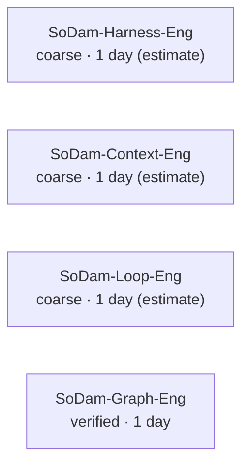

# SoDam-Graph-Eng (소담그래프엔지니어링)

> A Claude Code plugin that shows the location, progress stage, and dependencies of the "SoDam Seven Siblings" projects on a single map.
> **Written so that someone who has never coded before** can install and use it just by following this document.

---

## Table of Contents

1. [What is this?](#what-is-this)
2. [Prerequisites](#prerequisites)
3. [Required Programs](#required-programs)
4. [How to Download](#how-to-download)
5. [How to Install](#how-to-install)
6. [Quick Start (5 minutes)](#quick-start-5-minutes)
7. [How to Run](#how-to-run)
8. [How to Use](#how-to-use)
9. [How It Works (Principle)](#how-it-works-principle)
10. [Command List](#command-list)
11. [Update Summary](#update-summary)
12. [File / Document Locations](#file--document-locations)
13. [Workflow](#workflow)
14. [Architecture](#architecture)
15. [Security & Data Flow](#security--data-flow)
16. [Troubleshooting](#troubleshooting)
17. [FAQ](#faq)
18. [Legal / Copyright / License / Commercial Use](#legal--copyright--license--commercial-use)

---

## What is this?

A tool that saves you from re-explaining "which project am I in, how far did I get" every time you open a new session. It manages the location and progress stage of 7 projects ("siblings") in a single file (`graph.json`), and automatically informs the AI when a session opens.
**It never modifies sibling project files** — it only reads them.

---

## Prerequisites

You need to know how to open a terminal (the black command-input screen). On Windows, if you run `Claude Code`, you are already inside a terminal screen — you don't need to open anything else separately.

| What you need | Why it's needed | How to check | If missing |
|----------|-----------|----------|--------|
| **Claude Code** | This tool is a plugin that runs inside Claude Code | `claude --version` | Install from https://claude.com/claude-code |
| **git** | Used to read the progress of sibling projects. 🔴 **Not installed by default on Windows** — the point where absolute beginners get stuck most often | `git --version` | Install from https://git-scm.com, then **restart the terminal completely** |
| **Node.js** | This tool is built with Node.js | `node --version` | Install from https://nodejs.org (LTS version recommended) |
| **The SoDam sibling folders** | This is what the tool reads | Check with your own eyes that the folders actually exist | See [Troubleshooting 17-6](#17-6) |

---

## Required Programs

Same as the table above. There is no strict minimum version, but if git/Node.js are **very old versions**, commands may not be recognized — a version released within the last 1–2 years should be enough.

---

## How to Download

No separate download is needed. The commands in [How to Install](#how-to-install) below fetch everything automatically from GitHub.

---

## How to Install

Follow these steps exactly, inside Claude Code.

```
1. Start Claude Code
2. Type /plugin
3. Choose "Add marketplace"
4. Enter the install source — one of the two below

   (A) Install from GitHub  ← standard method
       sodam-ai/SoDam-Graph-Eng

   (B) Install from a folder on your computer  ← fallback if (A) doesn't work
       D:\my-work-folder\SoDam-Graph-Eng

5. Find sodam-graph in the list and press Install
6. Fully quit Claude Code and start it again
   (/exit → close the terminal window too → open a new terminal → claude)
7. Type /sodam-graph: in the input box. If the command list appears, the install succeeded
```

**Command-line method (copy-paste ready):**

```
# Install
/plugin marketplace add sodam-ai/SoDam-Graph-Eng
/plugin install sodam-graph@sodamgraph-marketplace

# Uninstall (for reinstall testing)
/plugin uninstall sodam-graph@sodamgraph-marketplace
/plugin marketplace remove sodamgraph-marketplace
```

🔴 **The combined form `plugin-name@marketplace-name` is required.** Typing only `/plugin install sodam-graph` will not install it.

🔴 **Step 6 (full restart) is the most commonly skipped step.** If you don't restart, the commands won't show up in the list at all → see [17-1](#17-1).

### 🟢 Verified — GitHub install works even for a PRIVATE repository

At the time of verification (M0, 2026-08-02), this repository was PRIVATE. Method (A) above still worked then (directly measured and confirmed) — it has since been switched to PUBLIC (2026-08-13):

```
claude plugin marketplace add sodam-ai/SoDam-Graph-Eng
  → ✔ Successfully added marketplace: sodamgraph-marketplace
claude plugin install sodam-graph@sodamgraph-marketplace
  → ✔ Successfully installed (scope: user) · Status: ✔ enabled
```

This works based on a logged-in (`gh auth`) account. If it doesn't work, see [17-23](#17-23).

---

## Quick Start (5 minutes)

```
1. Install (see above)
2. Fully quit and restart Claude Code   ← skip this and commands won't appear
3. Try typing /graph-where
4. If a sibling name and folder location appear, you're done
```

**Expected screen (actual output):**

```
SoDam-Loop-Eng (소담루프엔지니어링)   [as of 09:10]
  Repo root : D:\my-work-folder\SoDam-Loop-Eng\sodamloop
  Found by  : found_by_remote
  Role      : execute/repeat next steps (make→check→fix)
  Progress file : CHECKPOINT.md
```

If it doesn't work → see [17-1](#17-1).

---

## How to Run

There is no separate "run" step. Inside Claude Code, it activates when you type one of the slash commands in the [Command List](#command-list) below. It is not a program that runs constantly in the background.

---

## How to Use

**Scenario 1 — When you open a new session**: You don't need to do anything. If you open a session inside a sibling project folder, a 3-line notice appears automatically.

**Scenario 2 — When you're curious which project you're in, or where it is**: `/graph-where <name>`

**Scenario 3 — When you don't know what to do first today**: `/graph-next` (all 7 siblings) or `/graph-why` (just the one thing to do right now)

**Scenario 4 — When there isn't enough info and you only get a "rough judgment"**: `/graph-shadow` to fill it in once

**Scenario 5 — When a "done" suggestion was wrong**: `/graph-reject` (before it's confirmed) or `/graph-undo` (after it's already confirmed)

---

## How It Works (Principle)

1. It reads `graph.json` (the plan — set by a human)
2. It looks for where each sibling actually is right now (it doesn't store paths, so renaming a folder doesn't break it)
3. It scans the actual repository read-only (git commits, progress-tracking files)
4. If the plan and reality differ, it doesn't quietly pass — it tells you
5. It judges one single "next thing to do"
6. It saves a summary to `~/.sodam/graph-state.json` so the other SoDam siblings can read it
7. It stops here — **actual execution is handled by SoDam-Loop-Eng**

---

## Command List

| Command | What it does | When to use it |
|------|--------|----------|
| `/graph-where` | Shows which project you're in and where the folder is | When you're confused |
| `/graph-next` | Shows the next thing to do for each of the 7 siblings | When you want to see what to do next |
| `/graph-map` | Draws a diagram of how the 7 siblings relate | When you want the big picture |
| `/graph-why` | **If you can only pick one thing, this is it** | When you can't decide |
| `/graph-shadow` | Fills in a project that lacks enough information | When something shows as `coarse` |
| `/graph-reject` | Tells the tool "this isn't actually finished" | When a "done" suggestion is wrong (before confirmation) |
| `/graph-undo` | Reverts something that was already marked done | When something got marked done by mistake (after confirmation) |
| `/graph-verify` | Runs the verification command for real and confirms it if it passes | When a milestone can be checked automatically |
| `/graph-block` | Records or clears a human-only blocker | When something is stuck on work only a person can do |

### Actual Output Examples

<details><summary><code>/graph-next</code> (actual output, sibling name and judgment only — no paths)</summary>

```
🟡 SoDam-Loop-Eng
   (estimate — pending human confirmation) Next-task candidate: "SP2: batch approval live test → move to Phase 1b" and 6 more
   └ Basis: direct quote of unchecked items from the sibling's CHECKPOINT.md · run /graph-shadow once to make it exact
```
</details>

<details><summary><code>/graph-why</code> (actual output)</summary>

```
[If you can only solve one thing right now]  SoDam-Prompt-Eng · stage: rough judgment   [as of 08:47]

  Reason:
   · Stalled 7 days (based on the stagnation axis)
   · Score 7 × (1+0) × 0.7 = 4.9   (details unknown — estimate)
     #2 SoDam-Reverse-Eng  7 × (1+0) × 0.7 = 4.9  (1.0x)

  Next task: stage detail is still a rough judgment — progress file 343 lines · 120 checked items · 0 unchecked items
  └ Run /graph-shadow once to clean it up, and it will be judged automatically from then on.
```
</details>

**`/graph-map` (beginning of actual output)**



Save it as an `.md` file and open it with a GitHub preview or VS Code preview (`Ctrl+Shift+V`) to see it as a diagram. Seeing plain text in the terminal is normal.

<details><summary><code>/graph-reject</code> · <code>/graph-undo</code> (actual execution)</summary>

```
> /graph-reject sodam-graph-eng.M-example --reason "not confirmed yet"
Rejected — sodam-graph-eng.M-example has returned to verified. It will not be suggested again.

> /graph-undo sodam-graph-eng.M-example
Undone — sodam-graph-eng.M-example has returned to verified.
```
</details>

<details><summary><code>/graph-shadow</code> (list-mode actual output)</summary>

```
6 siblings with a rough judgment   [as of 09:10]

  🟡 SoDam-Harness-Eng
     No progress-tracking file at all — judged from git activity only
  🟡 SoDam-Loop-Eng
     Has a progress file, but the format differs per sibling so the stage can't be read (7 unchecked items)

🔴 Please don't do them all at once. These 2 are recommended first.
```
</details>

<details><summary><code>/graph-verify</code> (actual output — 3 outcomes: success/failure)</summary>

```
> /graph-verify sodam-graph-eng.M2   (success)
Verified — sodam-graph-eng.M2 has been confirmed as verified (3135ms).

> /graph-verify sodam-graph-eng.M0   (already past the verification stage)
Failed — already in "done" state — automatic verification only promotes todo/doing to verified

> /graph-verify sodam-loop-eng.current   (not eligible — a sibling's milestone, or its check method isn't automated)
Failed — not eligible for automatic verification (must be self-owned with an array-form verify_cmd)
```
</details>

<details><summary><code>/graph-block</code> (record/clear a human-only blocker, actual output)</summary>

```
> /graph-block sodam-loop-eng.current --kind human_test --description "live test in a new session"   (record)
Recorded — blk-001 (since 2026-08-21, sodam-loop-eng.current)

> /graph-block --resolve-block blk-001   (clear it once resolved)
Cleared — blk-001 (sodam-loop-eng.current)

> /graph-block sodam-loop-eng.current --kind bogus --description "x"   (wrong kind — only 5 values are allowed)
Failed — kind "bogus" is not allowed — must be one of human_test·legal·external_account·decision·purchase

> /graph-block no-such-milestone --kind legal --description "x"   (a milestone ID that doesn't exist)
Failed — no such milestone "no-such-milestone"
```

A recorded blocker automatically shows up at the end of `/graph-why`'s output, **sorted by longest wait first**:

```
1 human-only blocker (longest wait first):
  · SoDam-Loop-Eng · stage: rough judgment (milestone detail not extracted) — day 0 (human_test)
     └ live test in a new session   [blk-001]
```
</details>

---

## Update Summary

<details>
<summary><b>v0.2.0 (2026-08-21) — More accurate, and now tracks the human's share too</b></summary>

- Added the ability to **actually run a check command** to confirm a "done" condition, instead of requiring a human to look at it (`/graph-verify`)
- Added an option to keep finding sibling projects after moving to a different computer or folder location, via a single setting (developer-facing option)
- Added a safety gate so that a **damaged or corrupted** progress file (`data/graph.json`) is reported and stopped right away, instead of producing strange results
- Added the ability to record **work that only a human can do**, showing "waiting N days" automatically (`/graph-block`, shown at the end of `/graph-why`'s output)

</details>

<details>
<summary><b>v0.1.0 (2026-08-03) — First version</b></summary>

- Map of the 7 siblings and their next tasks
- Still finds a sibling even if its folder was renamed
- Automatic 3-line notice when a session opens
- The problem of "marked done but still stuck in place" — once enough evidence accumulates, "done" is auto-suggested; a human only needs to say "no"
- Points out the single thing to solve right now if you can only do one
- A project lacking information only needs to be asked once, then it's judged automatically from then on
- Fixed the problem of siblings being unable to read each other — a summary is saved to a shared location so other siblings can read it too

</details>

---

## File / Document Locations

**Files you may look at directly**

```
README.md                     This document (Korean)
README.en.md                  This document (English)
README.html / README.en.html  Web-page (browser-viewable) versions of the two documents above
CHECKPOINT.md                  List of work to continue next (milestones, verification method, status)
data/graph.json                Source of truth — the list/plan of the 7 siblings (tracked by git, no absolute paths)
data/baseline-2026-08-02.json  Snapshot taken at kickoff time, used as the comparison baseline for the "2-week report card"
docs/FAMILY_CONTRACT_PROPOSAL.md    Proposed updates submitted to sibling repositories (drafted only — pushing is a human task)
docs/FAMILY_INCONSISTENCY_REPORT.md Report of inconsistencies found among siblings
~/.sodam/graph-state.json      Summary that other SoDam siblings read (inside your own computer's user folder)
```

**Files that are created/removed automatically while running** (no need to create them yourself)

```
data/snapshot.json    Measurement cache — refreshed on every scan, not tracked by git
data/shadow/           Information a human filled in via /graph-shadow
data/rejected.json     History of /graph-reject actions (exists only when present)
data/.lock              Temporary lock file to prevent concurrent-run conflicts (exists only when present)
```

**Internal working code** (no need to open these in normal use)

```
lib/            The actual judging/scanning/publishing code (14 .mjs files)
hooks/          Code responsible for the automatic notice when a session starts
commands/       Descriptions for the 9 commands such as /graph-where
.claude-plugin/ Claude Code plugin registration files (marketplace.json · plugin.json)
tools/          Scripts for internal code checks
.PRD/           12 design documents used to plan this project
```

---

## Workflow

```
Start Claude Code in the morning
  → if you're inside a sibling folder, an automatic 3-line notice appears
  → if you don't know what to do, use /graph-why (human-only blockers show up here too)
  → if you want to see everything, use /graph-next
  → if a "done" condition can be checked automatically, use /graph-verify
  → if a "done" suggestion appears, leave it if correct, or /graph-reject if wrong
  → if you're stuck on something only a human can do, record it with /graph-block; once it's resolved, clear it with /graph-block again
```

---

## Architecture

```
[7 sibling folders] --read only--> [SoDam-Graph-Eng] --summary--> [~/.sodam/graph-state.json]
                              |                                    |
                          graph.json                        read by the 6 siblings
                        (plan / source of truth)
```

Look closely at the read-only arrows — there is no arrow going into the sibling folders. Nothing is ever modified.

---

## Security & Data Flow

| Question | Answer |
|-----------|----|
| Will it break my other projects? | **No.** It only reads. You can verify with a before/after `git status` comparison |
| Does it send anything over the internet? | **No.** There is no server or external transmission |
| Does it read passwords or keys? | **No.** Reading `.env` and key files is blocked at the code level |
| Where does it create files? | Only inside this program's own folder, plus one file: `~/.sodam/graph-state.json` |
| Is writing directly via `/graph-block`/`/graph-verify` also safe? | **Yes.** It only writes inside this program's own `data/graph.json`. Sibling folders are still read-only, and even if multiple windows write at the same time, they're handled safely in order (a lock mechanism) |
| Want to delete it? | See [17-17](#17-17) |

---

## Troubleshooting

Search for the exact message shown on your screen.

#### Installation stage

<a id="17-1"></a>**17-1. Nothing happens when you type a command / the `/graph-` commands are not in the list**
Cause: Claude Code was not restarted (most common). Fix: fully quit and relaunch — closing just the window is not enough, the program itself must end.

**17-2. `git: command not found` / `'git' is not recognized as an internal or external command`**
Cause: git is not installed (not installed by default on Windows). Fix: install git, then restart the terminal.

**17-3. `node: command not found`**
Cause: Node.js is not installed. Fix: install it, then restart the terminal.

**17-4. Adding the marketplace fails / `repository not found`**
Cause: no access to the PRIVATE repository, or a typo in the address. Fix: check login status with `gh auth status`.

**17-5. It installed, but only half the commands show up**
Cause: an old cached version. Fix: uninstall → reinstall → fully restart.

**17-20. The marketplace was added, but `sodam-graph` is not in the list**
Cause: manifest name mismatch (an issue on the maker's side). Fix: try reinstalling; if it still fails, report it as an issue.

**17-21. A message like "marketplace already exists"**
Cause: the marketplace name collides with another SoDam sibling's. Fix: this tool uses `sodamgraph-marketplace`. If it collides, change that name and add it again.

**17-22. After installing, opening a session doesn't show the automatic notice**
Cause: the hook registration file is missing, or the `SODAM_GRAPH_SILENT` environment variable is turned on. Fix: check the environment variable → see [17-8](#17-8).

<a id="17-23"></a>**17-23. `repository not found` / can't find the repository**
Cause: the repository is private and your logged-in account has no access, or a typo in the address. Fix: check login with `gh auth status` → if that doesn't help, install via method (B), the local folder method.
> ⚠ **Note**: This item is not a message we actually encountered — it is an **anticipated symptom**. In the actual M0 install test, method (A) **succeeded on the first try** — since there is no failure case yet, we could not fill in the exact on-screen wording. If you actually see this message, please let us know the exact wording so we can update this.

**17-24. Asked for permission/authentication, or denied** *(anticipated symptom — same reason as above)*
Cause: GitHub authentication expired or not set up. Fix: run `gh auth login`, then retry → if it still fails, fall back to method (B).

**17-25. `Cannot find marketplace.json`** *(anticipated symptom)*
Cause: `.claude-plugin/` is missing from the repository root (the repository is nested one folder deeper). Fix: check the repository root. SoDam-Loop-Eng actually has this exact structure (the repository is inside `sodamloop/`), so there is already a precedent within the family.

#### First run

**17-6. `Path lost — needs re-search` / `lost`**
Cause: the sibling folder is outside the search range. Fix: edit `config.search_roots` in `data/graph.json` to point to your own folder location.

**17-7. It shows `coarse (details unknown)`**
**This is normal.** Just fill it in once with `/graph-shadow`.

<a id="17-8"></a>**17-8. Nothing shows up when you open a session**
Cause: ① you opened it outside a sibling folder (normal) ② `SODAM_GRAPH_SILENT=1` is turned on. Fix: check the environment variable.

**17-9. Session startup got slower**
Cause: too many folders to scan. Fix: narrow the scope with `config.scan_filter`.

**17-10. Korean text is garbled as `???`**
Cause: terminal encoding is not UTF-8. Fix: run `chcp 65001` in PowerShell, then retry.

#### While using it

**17-11. A "done" suggestion appeared but it isn't actually finished**
Fix: `/graph-reject <item>` — it will not be suggested again.

**17-12. It was already marked done and you want to undo it**
Fix: `/graph-undo <item>`

**17-13. The `/graph-why` pick seems off**
Cause: ① the scan is stale ② it's `coarse`, so it's an estimate. Fix: check the scan timestamp, then re-run.

**17-14. Info looks different after working in another window**
**This is normal.** It can happen if you have multiple sessions open and working at the same time — check the `[as of HH:MM]` timestamp in the output.

**17-15. A command name collides with another SoDam plugin**
All commands in this tool start with `graph-` — there is no way for them to collide.

**17-16. `Circular dependency found` warning**
Cause: the plan has items waiting on each other in a loop. Fix: it shows exactly what is looped with what — you need to detach one of them.

**17-26. Running `/graph-verify` gives `Failed — not eligible for automatic verification`**
Cause: it's a sibling project's milestone, or that item's check method isn't automated yet (a human needs to check it directly). Fix: **this is normal** — please check it yourself.

**17-27. Running `/graph-verify` gives `Failed — already in "○○" state`**
Cause: the item already passed the verification stage and moved on. Fix: no need to run it again.

**17-28. Running `/graph-verify` gives `Failed — verification failed — ...`**
Cause: the check command was actually run and the condition wasn't met. Fix: pass along the exact reason in the message — it genuinely isn't finished yet.

**17-29. Running `/graph-block` gives `Failed — kind is not allowed`**
Cause: blocker kinds are only these 5: `human_test` (a test only a human can run) · `legal` (legal/licensing) · `external_account` (an external account) · `decision` (a human decision) · `purchase` (a purchase). Fix: re-enter it using one of these.

**17-30. Running `/graph-block` gives `Failed — no such milestone`**
Cause: a typo in the milestone ID. Fix: check the exact ID first with `/graph-where` or `/graph-next`.

**17-31. Running `/graph-block --resolve-block` gives `Failed — no such blocker id`**
Cause: it was already cleared, or the ID was typed wrong. Fix: check the current list of blockers again in `/graph-why`'s output.

#### Undo / Removal

<a id="17-17"></a>**17-17. To remove it completely**
Uninstall the plugin → delete `~/.sodam/graph-state.json` → (optionally) delete the program folder.

**17-18. You edited `graph.json` incorrectly**
You can revert it with `git checkout data/graph.json`.

**17-19. It looks like a sibling project changed**
**This tool did not do that.** Check with `git log` — it's likely that another session worked on it.

---

## FAQ

1. **Will using this change my project?** → No, it only reads (verifiable with a before/after `git status` comparison).
2. **Do I need an internet connection?** → Only when installing (to fetch from GitHub). Not needed afterward.
3. **Does it cost money?** → 0 won. No server, account, or subscription.
4. **Does it work on other computers too?** → Right now it's based on this PC. Support for other PCs is a future task.
5. **Can it see projects that aren't SoDam siblings?** → Right now, only the 7 siblings.
6. **What is `coarse`?** → It means "roughly known, but not known in detail."
7. **What happens if I ignore a "done" suggestion?** → It gets marked done on the next scan (actually tested and confirmed — not immediately, but after at least one more judgment run).
8. **Can I have multiple windows open?** → Yes. Just check the timestamp shown in the output.
9. **Can I rename a folder?** → **Yes.** It's found by repository address, not by name.
10. **Does the stored information include passwords?** → No. That said, the free-text description you type into `/graph-block` (what needs to happen for it to be resolved) is written by a human — if you type a password or personal information into it, it will be stored as-is. Please keep that field to plain text.
11. **What does `/graph-verify` check?** → Each milestone has a pre-defined "check command"; running it and having it pass automatically moves the milestone to the next stage. It only works on this tool's own items, and only a short pre-approved list of programs can ever be run.
12. **What does `/graph-block` do?** → It records "something only a human can do, that AI can't do instead." Once recorded, it automatically shows up in `/graph-why` as "waiting N days," and once it's resolved you have to clear it with a command yourself (if you don't, it keeps showing as waiting).
13. **Can I use this commercially?** → **Yes** (Apache-2.0, see [Legal](#legal--copyright--license--commercial-use) below).
14. **Where do I ask if something goes wrong?** → Please leave it as a repository issue.

---

## Legal / Copyright / License / Commercial Use

> ⚠️ **This section is not legal advice.** It is for reference only and does not guarantee legal effect. Before actual publication, distribution, delivery, or commercial use, **consulting a lawyer is recommended.** Final responsibility rests with the user.

### Basic Information

| Item | Content |
|------|------|
| License | This project follows the **Apache License 2.0** (see the `LICENSE` file for the full text, unedited and unexcerpted) |
| Copyright holder | Copyright 2026 SoDam AI Studio |
| Trademark notice | See the `NOTICE` file — third-party names mentioned in the documentation (Claude Code, Anthropic, etc.) are the property of their respective owners, and this project has **no affiliation, sponsorship, or endorsement relationship** with them |
| AI-generated content notice | Most of this project's code and documentation was **written using an AI tool (Claude Code)**. This is disclosed transparently |

### What You Can Do (under Apache-2.0)

Use · modify · copy/redistribute · **commercial use** · fork · **sell / operate as a service** · use for educational materials · **deliver to companies/clients** · use the patent grant (explicitly granted)

→ Condition: **you must include `LICENSE` and `NOTICE`, and disclose any changes you made.**

### What You Must Not Do

| Prohibition | Explanation |
|---|---|
| **Using the name/logo as if it were your own** | Apache-2.0 **does not grant trademark rights** — permission to use the code and permission to use the name are separate matters |
| **Claiming the original author endorses you** | Statements like "certified by SoDam AI Studio" are prohibited |
| **Overstated claims like "completely safe" or "no legal issues whatsoever"** | Prohibited because they contradict the limitation of liability below |

### Limitation of Liability (No Warranty)

This project is provided **"AS IS"**, with no warranty of any kind. Any damages arising from using this project (including data loss, business interruption, etc.) are **entirely the user's responsibility**. This follows §7 and §8 of the Apache License 2.0 text.

### What You Must Check Separately for Commercial Use

| Item | Content |
|---|---|
| **Trademarks** | See "What You Must Not Do" above — using the name/logo as your own brand is not allowed |
| **External API/service terms** | The terms of service for Claude Code, GitHub, etc. referenced by this project **are each provider's own policy**, and this project does not guarantee them on your behalf |
| **Individual contracts/NDAs** | When delivering to a client, an **individual contract may take precedence over the open-source license** |
| **Fonts/images/icons** | This project itself does not use any (terminal and markdown text only). If you add any, their license is **your own responsibility** |

### Note on Sibling Projects (the other 6 SoDam siblings)

This project only **reads** the progress of the other 6 SoDam projects, and does not include or redistribute their code or documents. **Each sibling project's license belongs to that project itself, and this README does not guarantee it on their behalf.**

### External Materials / Dependencies

This project itself **uses no external packages (npm)** — only Node.js built-in features and the `git` command. It includes no images, fonts, audio, video, or open-source code snippets. This is the project's strongest legal defense — **if nothing is included, there is nothing to infringe.**

### Personal Information / Non-public Materials

Neither this README nor this project's examples/fixtures contain **actual personal information (names, emails, phone numbers, account IDs).** Real PC paths in on-screen examples have been masked in the form `D:\my-work-folder\...`.

### For More Detail

Expert-level supporting detail (tables separating confirmed facts from items requiring review, the procedure for handling a switch to public, etc.) is in `.PRD/09_LEGAL_LICENSE_SPEC.md`.
