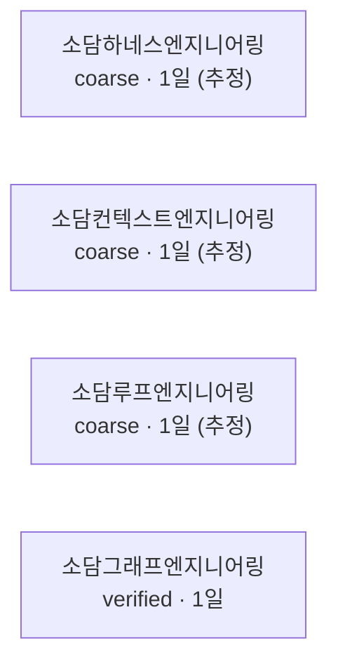

# 소담그래프엔지니어링 (SoDam-Graph-Eng)

> 소담 7형제의 위치·진행단계·의존관계를 지도 하나로 보여주는 Claude Code 플러그인입니다.
> **코딩을 한 번도 해본 적 없어도** 이 문서만 보고 설치·사용할 수 있게 썼습니다.

---

## 목차

1. [이게 뭔가요?](#이게-뭔가요)
2. [사전 준비물](#사전-준비물)
3. [필요 프로그램](#필요-프로그램)
4. [다운로드 방법](#다운로드-방법)
5. [설치 방법](#설치-방법)
6. [빠른 시작 (5분)](#빠른-시작-5분)
7. [실행 방법](#실행-방법)
8. [사용 방법](#사용-방법)
9. [작동 방법(원리)](#작동-방법원리)
10. [명령어 목록](#명령어-목록)
11. [업데이트 내용 요약](#업데이트-내용-요약)
12. [파일·문서 위치](#파일문서-위치)
13. [워크플로우](#워크플로우)
14. [아키텍처](#아키텍처)
15. [보안·데이터 흐름](#보안데이터-흐름)
16. [문제·오류 대처](#문제오류-대처)
17. [FAQ](#faq)
18. [법률·저작권·라이선스·상업적 용도](#법률저작권라이선스상업적-용도)

---

## 이게 뭔가요?

새 세션을 열 때마다 "지금 어느 프로젝트, 어디까지 했더라"를 다시 설명하지 않아도 되게 해주는 도구입니다. 7개 프로젝트(형제)의 위치와 진행 단계를 파일 하나(`graph.json`)로 관리하고, 세션이 열리면 AI에게 자동으로 알려줍니다.
**형제 프로젝트 파일은 절대 고치지 않습니다** — 읽기만 합니다.

---

## 사전 준비물

터미널(명령어를 입력하는 검은 화면)을 열 줄 알아야 합니다. Windows 기준으로 `Claude Code` 를 실행하면 이미 터미널 화면 안에 있는 것입니다 — 별도로 뭔가를 더 열 필요는 없습니다.

| 필요한 것 | 왜 필요한가 | 확인 방법 | 없으면 |
|----------|-----------|----------|--------|
| **Claude Code** | 이 도구는 Claude Code 안에서 도는 플러그인입니다 | `claude --version` | https://claude.com/claude-code 에서 설치 |
| **git** | 형제 프로젝트의 진행 상황을 읽는 데 씁니다. 🔴 **Windows에는 기본 설치가 안 되어 있습니다** — 왕초보가 가장 많이 막히는 지점입니다 | `git --version` | https://git-scm.com 에서 설치 후 **터미널을 완전히 재시작** |
| **Node.js** | 이 도구가 Node.js로 만들어졌습니다 | `node --version` | https://nodejs.org 에서 설치(LTS 버전 권장) |
| **소담 형제 폴더들** | 이 도구가 읽을 대상입니다 | 폴더가 실제로 있는지 눈으로 확인 | [문제 대처 17-6](#17-6) 참조 |

---

## 필요 프로그램

위 표와 같습니다. 최소 버전 제한은 없지만, git·Node.js가 **너무 오래된 버전**이면 명령이 인식되지 않을 수 있습니다 — 최근 1~2년 내 배포된 버전이면 충분합니다.

---

## 다운로드 방법

별도 다운로드가 필요 없습니다. 아래 [설치 방법](#설치-방법)의 명령이 GitHub에서 자동으로 받아옵니다.

---

## 설치 방법

Claude Code 안에서 아래 순서 그대로 따라 하세요.

```
1. Claude Code 를 켠다
2. /plugin 을 입력한다
3. "마켓플레이스 추가(Add marketplace)" 를 고른다
4. 설치 소스를 입력한다 — 아래 둘 중 하나

   (A) GitHub 에서 설치  ← 표준 방법
       sodam-ai/SoDam-Graph-Eng

   (B) 내 컴퓨터 폴더로 설치  ← (A) 가 안 될 때 폴백
       D:\내작업폴더\SoDam-Graph-Eng

5. 목록에서 sodam-graph 를 찾아 설치(Install) 를 누른다
6. Claude Code 를 완전히 끄고 다시 켠다
   (/exit → 터미널 창도 닫기 → 새 터미널 → claude)
7. 입력칸에 /sodam-graph: 를 친다. 명령 목록이 뜨면 설치 성공
```

**명령으로 하는 방법 (복붙 가능):**

```
# 설치
/plugin marketplace add sodam-ai/SoDam-Graph-Eng
/plugin install sodam-graph@sodamgraph-marketplace

# 제거 (재설치 테스트용)
/plugin uninstall sodam-graph@sodamgraph-marketplace
/plugin marketplace remove sodamgraph-marketplace
```

🔴 **`플러그인이름@마켓플레이스이름` 결합 형식이 필수입니다.** `/plugin install sodam-graph` 만 쓰면 설치되지 않습니다.

🔴 **6번(완전 재시작)을 가장 많이 빠뜨립니다.** 재시작하지 않으면 명령이 목록에 아예 안 보입니다 → [17-1](#17-1) 참조.

### 🟢 검증 완료 — PRIVATE 저장소도 GitHub 설치가 됩니다

검증 당시(M0, 2026-08-02)엔 이 저장소가 PRIVATE 상태였습니다. 그때도 위 (A) 방법이 됐습니다(직접 실측 확인) — 지금은 PUBLIC으로 전환됐습니다(2026-08-13):

```
claude plugin marketplace add sodam-ai/SoDam-Graph-Eng
  → ✔ Successfully added marketplace: sodamgraph-marketplace
claude plugin install sodam-graph@sodamgraph-marketplace
  → ✔ Successfully installed (scope: user) · Status: ✔ enabled
```

로그인된(`gh auth`) 계정 기준으로 됩니다. 안 되면 [17-23](#17-23)을 보세요.

---

## 빠른 시작 (5분)

```
1. 설치한다 (위 참조)
2. Claude Code를 완전히 껐다 켠다   ← 이거 안 하면 명령이 안 보임
3. /graph-where 라고 쳐본다
4. 형제 이름과 폴더 위치가 나오면 성공
```

**예상 화면 (실제 출력):**

```
소담루프엔지니어링 (SoDam-Loop-Eng)   [09:10 기준]
  저장소 루트 : D:\내작업폴더\SoDam-Loop-Eng\sodamloop
  찾은 방법   : found_by_remote
  역할        : 다음 단계 실행·반복 (make→check→fix)
  진행 기록   : CHECKPOINT.md
```

안 되면 → [17-1](#17-1) 참조.

---

## 실행 방법

별도 실행이 없습니다. Claude Code 안에서 아래 [명령어 목록](#명령어-목록)의 슬래시 명령을 치면 그때 동작합니다. 백그라운드에서 항상 도는 프로그램이 아닙니다.

---

## 사용 방법

**시나리오 1 — 세션을 새로 열었을 때**: 아무것도 안 해도 됩니다. 형제 프로젝트 폴더 안에서 세션을 열면 자동으로 3줄 안내가 뜹니다.

**시나리오 2 — 어느 프로젝트인지, 어디 있는지 궁금할 때**: `/graph-where 이름`

**시나리오 3 — 오늘 뭐부터 할지 모를 때**: `/graph-next` (7형제 전체) 또는 `/graph-why` (지금 딱 하나만)

**시나리오 4 — 정보가 부족해서 "거친 판정"으로만 나올 때**: `/graph-shadow` 로 한 번만 채워 넣기

**시나리오 5 — 완료 제안이 틀렸을 때**: `/graph-reject` (아직 확정 전) 또는 `/graph-undo` (이미 확정된 뒤)

---

## 작동 방법(원리)

1. `graph.json` 을 읽습니다(계획 — 사람이 정한 것)
2. 형제가 지금 어디 있는지 다시 찾습니다(경로를 저장해두지 않아서, 폴더 이름을 바꿔도 안 깨집니다)
3. 실제 저장소를 읽기 전용으로 훑습니다(git 커밋, 진행 기록 파일)
4. 계획과 실제가 다르면 조용히 넘기지 않고 알립니다
5. 다음 할 일 1개를 판정합니다
6. 요약을 `~/.sodam/graph-state.json` 에 저장해, 다른 소담 형제들이 읽어갈 수 있게 합니다
7. 여기서 멈춥니다 — **실제 실행은 소담루프엔지니어링 담당**입니다

---

## 명령어 목록

| 명령 | 뭘 하나 | 언제 쓰나 |
|------|--------|----------|
| `/graph-where` | 지금 어느 프로젝트이고 폴더가 어디인지 | 헷갈릴 때 |
| `/graph-next` | 7형제 각각의 다음 할 일 | 뭐부터 할지 볼 때 |
| `/graph-map` | 7형제 관계 그림 | 전체를 보고 싶을 때 |
| `/graph-why` | **딱 하나만 고르라면 이것** | 결정을 못 하겠을 때 |
| `/graph-shadow` | 정보가 부족한 프로젝트를 채워 넣음 | `coarse` 라고 뜰 때 |
| `/graph-reject` | "아직 안 끝났어" 라고 알려줌 | 완료 제안이 틀렸을 때(확정 전) |
| `/graph-undo` | 이미 완료된 걸 되돌림 | 실수로 완료됐을 때(확정 후) |

### 실제 출력 예시

<details><summary><code>/graph-next</code> (실제 출력, 형제 이름·판정만 — 경로 없음)</summary>

```
🟡 소담루프엔지니어링
   (추정 — 사람 확인 전) 다음 할 일 후보: "SP2: 배치 승인 live 테스트 → Phase 1b로 이동" 외 6건
   └ 근거: 형제 CHECKPOINT.md 의 미완료 표시 원문 인용 · 정확히 하려면 /graph-shadow 로 한 번만 정리하세요.
```
</details>

<details><summary><code>/graph-why</code> (실제 출력)</summary>

```
[지금 딱 하나만 푼다면]  소담프롬프트엔지니어링 · 진행 단계 거친 판정   [08:47 기준]

  이유:
   · 7일 정지 (정체 축 기준)
   · 점수 7 × (1+0) × 0.7 = 4.9   (상세 미상 — 추정치)
     2위 소담리버스엔지니어링  7 × (1+0) × 0.7 = 4.9  보다 1.0배

  다음 할 일: 상세 단계는 아직 거친 판정입니다 — 진행 기록 343줄 · 완료 표시 120개 · 미완료 0건
  └ /graph-shadow 로 한 번만 정리하면 그다음부터 자동 판정됩니다.
```
</details>

**`/graph-map` (실제 출력 앞부분)**



`.md` 파일로 저장해서 GitHub나 VS Code 미리보기(`Ctrl+Shift+V`)로 열면 그림으로 보입니다. 터미널에는 글자만 나오는 게 정상입니다.

<details><summary><code>/graph-reject</code> · <code>/graph-undo</code> (실제 실행 확인)</summary>

```
> /graph-reject sodam-graph-eng.M-예시 --reason "아직 확인 전"
거부 완료 — sodam-graph-eng.M-예시 는 verified 로 복귀했습니다. 다시 제안되지 않습니다.

> /graph-undo sodam-graph-eng.M-예시
되돌리기 완료 — sodam-graph-eng.M-예시 는 verified 로 복귀했습니다.
```
</details>

<details><summary><code>/graph-shadow</code> (목록 모드 실제 출력)</summary>

```
거친 판정인 형제 6곳   [09:10 기준]

  🟡 소담하네스엔지니어링
     진행 기록 파일이 아예 없어 git 활동만으로 판단 중
  🟡 소담루프엔지니어링
     진행 기록은 있으나 형제마다 형식이 달라 단계를 못 읽음 (미완료 7건)

🔴 한 번에 다 하지 마세요. 먼저 이 2곳만 권합니다.
```
</details>

---

## 업데이트 내용 요약

<details>
<summary><b>v0.1.0 (2026-08-03) — 첫 버전</b></summary>

- 7형제 지도와 다음 할 일 알려주기
- 폴더 이름이 바뀌어도 찾아내기
- 세션 열 때 자동으로 3줄 안내
- 완료됐는데 계속 그 자리인 문제 — 증거가 모이면 자동으로 완료 제안, 사람은 "아니오"만 하면 됨
- 지금 딱 하나만 풀어야 한다면 무엇인지 지목
- 정보가 부족한 형제는 한 번만 물어보면 그다음부터 자동 판정
- 형제끼리 서로 못 읽던 문제 — 요약본을 공유 위치에 저장해 다른 형제도 읽을 수 있음

</details>

---

## 파일·문서 위치

**사용자가 직접 볼 일이 있는 파일**

```
README.md                     이 문서 (한국어)
README.en.md                  이 문서 (영어)
README.html / README.en.html  위 두 문서의 웹페이지(브라우저로 열람) 버전
CHECKPOINT.md                  다음에 이어서 할 작업 목록(마일스톤·검증 방법·상태)
data/graph.json                정본 — 7형제 목록·계획 (git 으로 관리됨, 절대경로 없음)
data/baseline-2026-08-02.json  2주 성적표를 낼 때 비교 기준이 되는 착수 시점 스냅샷
docs/FAMILY_CONTRACT_PROPOSAL.md    형제 저장소에 제출하는 갱신안(작성만, push는 사람 몫)
docs/FAMILY_INCONSISTENCY_REPORT.md 형제 간 발견된 불일치 보고서
~/.sodam/graph-state.json      다른 소담 형제가 읽어가는 요약본 (내 컴퓨터의 사용자 폴더 안)
```

**동작 중 자동으로 생기고 없어지는 파일** (직접 만들 필요 없음)

```
data/snapshot.json    실측 캐시 — 스캔할 때마다 갱신됨, git 으로 관리 안 함
data/shadow/           /graph-shadow 로 사람이 채워준 정보
data/rejected.json     /graph-reject 이력 (있을 때만 존재)
data/.lock              동시 실행 충돌 방지용 임시 잠금 파일 (있을 때만 존재)
```

**내부 동작 코드** (평소에 직접 열어볼 필요 없음)

```
lib/            판정·스캔·발행 등 실제 동작 코드 (.mjs 파일 13개)
hooks/          세션 시작 시 자동 안내를 담당하는 코드
commands/       /graph-where 등 명령어 7개의 설명서
.claude-plugin/ Claude Code 플러그인 등록 파일(marketplace.json·plugin.json)
tools/          내부 코드 점검용 스크립트
.PRD/           이 프로젝트를 설계할 때 쓴 기획 문서 12개
```

---

## 워크플로우

```
아침에 Claude Code 를 켠다
  → 형제 폴더 안이면 자동으로 3줄 안내가 뜬다
  → 뭐부터 할지 모르면 /graph-why
  → 전체를 보고 싶으면 /graph-next
  → 완료 제안이 뜨면 맞으면 두고, 틀리면 /graph-reject
```

---

## 아키텍처

```
[7형제 폴더] --읽기만--> [소담그래프엔지니어링] --요약--> [~/.sodam/graph-state.json]
                              |                                    |
                          graph.json                        6형제가 읽어감
                        (계획·정본)
```

읽기만 하는 화살표를 잘 보세요 — 형제 폴더 쪽으로 들어가는 화살표가 없습니다. 아무것도 고치지 않습니다.

---

## 보안·데이터 흐름

| 궁금한 것 | 답 |
|-----------|----|
| 내 다른 프로젝트를 망가뜨리나요? | **아니요.** 읽기만 합니다. `git status` 로 전후 비교해 확인할 수 있습니다 |
| 인터넷으로 뭘 보내나요? | **아니요.** 서버·외부 전송이 없습니다 |
| 비밀번호나 키를 읽나요? | **아니요.** `.env`·키 파일은 읽지 않도록 코드 수준에서 막아뒀습니다 |
| 어디에 파일을 만드나요? | 이 프로그램 폴더 안, 그리고 `~/.sodam/graph-state.json` 하나뿐입니다 |
| 지우고 싶으면? | [17-17](#17-17) 참조 |

---

## 문제·오류 대처

화면에 뜬 문구를 그대로 찾아보세요.

#### 설치 단계

<a id="17-1"></a>**17-1. 명령을 쳤는데 반응이 없다 / `/graph-` 명령이 목록에 없다**
원인: Claude Code 재시작 안 함(가장 흔함). 해결: 완전히 종료 후 재실행 — 창만 닫는 게 아니라 프로그램 자체를 끝내야 합니다.

**17-2. `git: command not found` / `'git'은(는) 내부 또는 외부 명령이 아닙니다`**
원인: git 미설치(Windows 기본 미설치). 해결: git 설치 후 터미널 재시작.

**17-3. `node: command not found`**
원인: Node.js 미설치. 해결: 설치 후 터미널 재시작.

**17-4. 마켓플레이스 추가 실패 / `repository not found`**
원인: PRIVATE 저장소 권한 또는 주소 오타. 해결: `gh auth status` 로 로그인 확인.

**17-5. 설치는 됐는데 명령이 반만 보인다**
원인: 옛 버전 캐시. 해결: 제거 → 재설치 → 완전 재시작.

**17-20. 마켓플레이스는 추가됐는데 `sodam-graph` 가 목록에 없다**
원인: 매니페스트 이름 불일치(제작자 측 문제). 해결: 재설치 시도 후 안 되면 이슈로 보고.

**17-21. `이미 존재하는 마켓플레이스` 류 메시지**
원인: 다른 소담 형제와 마켓플레이스 이름이 겹침. 해결: 이 도구는 `sodamgraph-marketplace` 를 씁니다. 겹치면 그 이름을 바꿔 다시 추가.

**17-22. 설치 후 세션을 열어도 자동 안내가 안 뜬다**
원인: 훅 등록 파일 누락 또는 `SODAM_GRAPH_SILENT` 환경변수가 켜져 있음. 해결: 환경변수 확인 → [17-8](#17-8).

<a id="17-23"></a>**17-23. `repository not found` / 저장소를 못 찾음**
원인: 저장소가 비공개인데 로그인 계정에 권한이 없음, 또는 주소 오타. 해결: `gh auth status` 로 로그인 확인 → 안 되면 (B) 내 컴퓨터 폴더 방식으로 설치.
> ⚠ **참고**: 이 항목은 실제로 겪은 메시지가 아니라 **예상 증상**입니다. M0 설치 실측에서는 (A) 방법이 **한 번에 성공**했습니다 — 실패 사례가 아직 없어 정확한 화면 문구를 못 채웠습니다. 실제로 이 메시지를 보셨다면 정확한 문구를 알려주시면 갱신하겠습니다.

**17-24. 권한/인증을 묻거나 거부당함** *(예상 증상 — 위와 동일 사유)*
원인: GitHub 인증이 만료·미설정. 해결: `gh auth login` 후 재시도 → 그래도 안 되면 (B) 폴백.

**17-25. `marketplace.json 을 찾을 수 없음`** *(예상 증상)*
원인: 저장소 루트에 `.claude-plugin/` 이 없음(저장소가 폴더 한 겹 안쪽인 경우). 해결: 저장소 루트를 확인하세요. 소담루프엔지니어링이 실제로 이 구조(`sodamloop/` 안이 저장소)라 패밀리 안에 선례가 있습니다.

#### 첫 실행 단계

**17-6. `경로 유실 — 재탐색 필요` / `lost`**
원인: 형제 폴더가 검색 범위 밖. 해결: `data/graph.json` 의 `config.search_roots` 를 자기 폴더 위치로 수정.

**17-7. `coarse (상세 미상)` 이라고 나온다**
**정상입니다.** `/graph-shadow` 로 한 번만 채우면 됩니다.

<a id="17-8"></a>**17-8. 세션을 열어도 아무것도 안 뜬다**
원인: ① 형제 폴더 밖에서 열었음(정상) ② `SODAM_GRAPH_SILENT=1` 켜짐. 해결: 환경변수 확인.

**17-9. 세션 시작이 느려졌다**
원인: 폴더가 많아 스캔이 오래 걸림. 해결: `config.scan_filter` 로 범위를 좁힘.

**17-10. 한글이 깨져 `???` 로 나온다**
원인: 터미널 인코딩(UTF-8 아님). 해결: PowerShell 에서 `chcp 65001` 실행 후 재시도.

#### 사용 중

**17-11. 완료 제안이 떴는데 아직 안 끝났다**
해결: `/graph-reject <항목>` — 다시 제안하지 않습니다.

**17-12. 이미 완료 처리됐는데 되돌리고 싶다**
해결: `/graph-undo <항목>`

**17-13. `/graph-why` 지목이 이상하다**
원인: ① 스캔이 오래됨 ② `coarse` 라 추정치. 해결: 스캔 시각 확인 후 재실행.

**17-14. 다른 창에서 작업했더니 정보가 다르다**
**정상입니다.** 여러 세션을 동시에 켜고 작업하면 그럴 수 있습니다 — 출력의 `[HH:MM 기준]` 시각을 확인하세요.

**17-15. 명령 이름이 다른 소담 플러그인과 겹친다**
이 도구는 전부 `graph-` 로 시작합니다 — 겹칠 일이 없습니다.

**17-16. `순환 의존 발견` 경고**
원인: 계획이 서로를 기다리는 상태. 해결: 무엇과 무엇이 물렸는지 표시됨 — 하나를 떼어내야 합니다.

#### 되돌리기·제거

<a id="17-17"></a>**17-17. 완전히 지우려면**
플러그인 제거 → `~/.sodam/graph-state.json` 삭제 → (원하면) 프로그램 폴더 삭제.

**17-18. `graph.json` 을 잘못 고쳤다**
`git checkout data/graph.json` 으로 되돌릴 수 있습니다.

**17-19. 형제 프로젝트가 바뀐 것 같다**
**이 도구는 쓰지 않습니다.** `git log` 로 확인해보세요 — 다른 세션이 작업했을 가능성이 큽니다.

---

## FAQ

1. **이걸 쓰면 제 프로젝트가 바뀌나요?** → 아니요, 읽기만 합니다(`git status` 전후 비교로 확인 가능).
2. **인터넷 연결이 필요한가요?** → 설치할 때만(GitHub에서 받아올 때). 이후엔 필요 없습니다.
3. **돈이 드나요?** → 0원. 서버·계정·구독 없음.
4. **다른 컴퓨터에서도 되나요?** → 지금은 이 PC 기준입니다. 다른 PC는 다음 단계 과제입니다.
5. **소담 형제가 아닌 프로젝트도 볼 수 있나요?** → 지금은 7형제만입니다.
6. **`coarse` 가 뭔가요?** → "대충은 아는데 자세히는 모르는 상태"입니다.
7. **완료 제안을 무시하면?** → 다음 스캔에서 완료 처리됩니다(실제로 테스트해서 확인했습니다 — 즉시가 아니라 최소 한 번의 판정 실행 뒤입니다).
8. **여러 창을 켜도 되나요?** → 됩니다. 출력의 시각 표시를 확인하세요.
9. **폴더 이름을 바꿔도 되나요?** → **됩니다.** 이름이 아니라 저장소 주소로 찾습니다.
10. **저장하는 정보에 비밀번호가 들어가나요?** → 아니요.
11. **상업적으로 써도 되나요?** → **됩니다**(Apache-2.0, 아래 [법률](#법률저작권라이선스상업적-용도) 참조).
12. **문제가 생기면 어디에 물어보나요?** → 저장소 이슈로 남겨주세요.

---

## 법률·저작권·라이선스·상업적 용도

> ⚠️ **이 절은 법률 자문이 아닙니다.** 참고용이며 법적 효력을 보장하지 않습니다. 실제 공개·배포·납품·상업적 사용 전에는 **변호사 확인을 권장**합니다. 최종 책임은 사용자에게 있습니다.

### 기본 정보

| 항목 | 내용 |
|------|------|
| 라이선스 | 이 프로젝트는 **Apache License 2.0** 을 따릅니다 (전문은 `LICENSE` 파일 참조, 발췌·수정 없이 원문 그대로) |
| 저작권자 | Copyright 2026 SoDam AI Studio |
| 상표 고지 | `NOTICE` 파일 참조 — 문서에 언급된 타사 이름(Claude Code·Anthropic 등)은 각 소유자의 자산이며, 이 프로젝트와 **제휴·후원·인증 관계가 없습니다** |
| AI 생성물 고지 | 이 프로젝트의 코드·문서 대부분은 **AI 도구(Claude Code)를 사용해 작성**됐습니다. 투명하게 밝힙니다 |

### 할 수 있는 것 (Apache-2.0 기준)

사용 · 수정 · 복제·재배포 · **상업적 사용** · 포크 · **판매·서비스 운영** · 교육 자료 활용 · **회사·고객사 납품** · 특허 사용(명시적 허여)

→ 조건: **`LICENSE`·`NOTICE` 를 같이 넣고, 고친 부분은 고쳤다고 밝혀야 합니다.**

### 하면 안 되는 것

| 금지 사항 | 설명 |
|---|---|
| **이름·로고를 자기 것처럼 쓰기** | Apache-2.0은 **상표권을 허여하지 않습니다** — 코드 사용 허가와 이름 사용 허가는 별개입니다 |
| **원저작자가 보증한다고 말하기** | "SoDam AI Studio가 인증했다" 같은 표현 금지 |
| **"완전히 안전"·"법적으로 문제없음" 같은 과장 표현** | 아래 책임 제한과 모순되는 표현이라 금지합니다 |

### 책임 제한 (보증 없음)

이 프로젝트는 **"있는 그대로(AS IS)"** 제공되며, 어떤 형태의 보증도 하지 않습니다. 이 프로젝트를 사용해서 생긴 손해(데이터 손실·업무 중단 등 포함)는 **전적으로 사용자 책임**입니다. Apache License 2.0 원문 §7·§8을 따릅니다.

### 상업적으로 쓸 때 사용자가 별도로 확인해야 하는 것

| 항목 | 내용 |
|---|---|
| **상표** | 위 "하면 안 되는 것" 참조 — 이름·로고를 자기 브랜드처럼 사용 불가 |
| **외부 API·서비스 약관** | 이 프로젝트가 참조하는 Claude Code·GitHub 등의 **이용 약관은 각 제공사 정책**이며, 이 프로젝트가 대신 보장하지 않습니다 |
| **개별 계약·NDA** | 고객사 납품 시 **개별 계약이 오픈소스 라이선스보다 우선**할 수 있습니다 |
| **폰트·이미지·아이콘** | 이 프로젝트 자체는 미사용(터미널·마크다운 텍스트만). 사용자가 추가하면 그 라이선스는 **사용자 책임**입니다 |

### 형제 프로젝트(소담 6형제)에 대한 안내

이 프로젝트는 다른 6개 소담 프로젝트의 진행 상황을 **읽기만** 하며, 그 저장소들의 코드·문서를 포함하거나 재배포하지 않습니다. **각 형제 프로젝트의 라이선스는 그 프로젝트 자신의 것이며, 이 README가 대신 보증하지 않습니다.**

### 외부 자료·의존성

이 프로젝트 자체는 **외부 패키지(npm)를 쓰지 않습니다** — Node.js 기본 기능과 `git` 명령만 사용합니다. 이미지·폰트·음원·영상·오픈소스 코드 조각을 포함하지 않습니다. 이것이 이 프로젝트의 가장 강한 법적 방어입니다 — **포함한 게 없으면 침해할 것도 없습니다.**

### 개인정보·비공개 자료

이 README와 이 프로젝트의 예시·픽스처에는 **실제 개인정보(이름·이메일·전화번호·계정 ID)를 포함하지 않습니다.** 화면 예시의 실제 PC 경로는 `D:\내작업폴더\...` 형태로 가려서 표기했습니다.

### 더 자세한 내용

전문가용 상세 근거(확인된 사실과 검토 필요 사항을 분리한 표, 공개 전환 시 처리 절차 등)는 `.PRD/09_LEGAL_LICENSE_SPEC.md` 에 있습니다.
